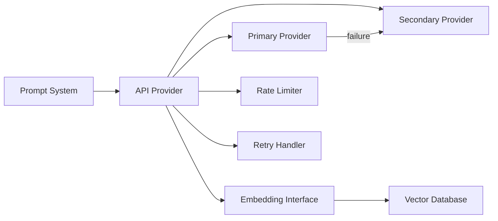

# API Provider

**Authority:** `GOVERNANCE/ARCHITECTURE_AUTHORITY.md`
**Registry:** `GOVERNANCE/PIPELINE_REGISTRY.md`
**Department:** Knowledge
**Status:** ACTIVE
**Version:** 1.0.0
**Last Updated:** 2026-07-22

---

## Purpose

The API Provider is the abstract interface layer between the Umakraft AI Knowledge Service and the underlying AI model providers. It normalises the differences between providers, handles retries, applies rate limiting, manages model selection, and implements the fallback strategy so that the rest of the system never needs to know which specific provider or model is currently serving requests.

---

## Scope

| In Scope | Out of Scope |
|---|---|
| Provider abstraction (OpenAI, Gemini, Claude, OpenRouter, Ollama) | Prompt assembly |
| Request retries with exponential backoff | Context retrieval |
| Rate limit enforcement | Response validation |
| Model selection per request type | Caching (handled by Cache layer) |
| Fallback to secondary provider on failure | Topic classification |
| Embedding generation for the Vector Database | |
| Token counting for prompt budget enforcement | |

---

## Responsibilities

- Expose a single unified `generate(prompt, options)` interface to the Prompt System
- Expose a single `embed(text)` interface to the Repository Indexer and RAG Engine
- Route requests to the configured primary provider
- Retry failed requests with exponential backoff (max 3 attempts)
- Fall back to the secondary provider if the primary is unavailable
- Enforce per-minute and per-day rate limits
- Never expose API keys outside of the provider layer

---

## Supported Providers

| Provider | Chat Models | Embedding Models | Notes |
|---|---|---|---|
| OpenAI | gpt-4o, gpt-4o-mini, gpt-4-turbo | text-embedding-3-small, text-embedding-3-large | Default provider |
| Gemini | gemini-1.5-pro, gemini-1.5-flash | text-embedding-004 | Large context window |
| Claude | claude-3-5-sonnet, claude-3-haiku | — (use OpenAI embeddings) | Strong reasoning |
| OpenRouter | Any supported model | — | Router for multiple providers |
| Ollama | Any locally hosted model | nomic-embed-text | Offline/private deployments |

---

## Architecture



---

## Workflow

### Chat Generation

1. Prompt System calls `generate(prompt, options)`
2. API Provider selects the primary provider from configuration
3. Rate Limiter checks the current request count against the per-minute limit
4. If rate limited, the request is queued or rejected with a retry-after value
5. The request is sent to the primary provider
6. On success, the response text is returned
7. On failure (network error, 5xx, timeout):
   - Retry handler waits (exponential backoff: 1s, 2s, 4s)
   - After 3 failures, falls back to the secondary provider
   - If secondary also fails, returns a graceful error response

### Embedding Generation

1. Repository Indexer or RAG Engine calls `embed(text)`
2. API Provider sends the text to the configured embedding model
3. Returns a float32 vector of the configured dimension
4. Embedding model must match between indexing and query time

---

## Technical Design

### Interface

```js
/**
 * Generate a chat completion.
 * @param {string} prompt
 * @param {{ model?: string, maxTokens?: number, temperature?: number }} options
 * @returns {Promise<{ text: string, model: string, tokens: number }>}
 */
export async function generate(prompt, options = {}) { ... }

/**
 * Generate an embedding vector.
 * @param {string} text
 * @returns {Promise<number[]>}
 */
export async function embed(text) { ... }
```

### Configuration

```text
AI_PRIMARY_PROVIDER=openai
AI_SECONDARY_PROVIDER=gemini
AI_PRIMARY_MODEL=gpt-4o-mini
AI_SECONDARY_MODEL=gemini-1.5-flash
AI_EMBEDDING_MODEL=text-embedding-3-small
AI_MAX_RETRIES=3
AI_RETRY_BASE_DELAY_MS=1000
AI_RATE_LIMIT_RPM=60
OPENAI_API_KEY=<secret>
GEMINI_API_KEY=<secret>
ANTHROPIC_API_KEY=<secret>
OPENROUTER_API_KEY=<secret>
OLLAMA_BASE_URL=http://localhost:11434
```

All API keys are loaded from environment variables. They are never logged, included in prompts, or returned in responses.

### Retry Strategy

```text
Attempt 1 → immediate
Attempt 2 → wait 1000ms
Attempt 3 → wait 2000ms
Attempt 4 → fallback to secondary provider
```

### Rate Limiting

```text
Per-minute limit: configurable via AI_RATE_LIMIT_RPM (default: 60)
Enforcement: sliding window counter
On limit reached: return 429-equivalent with retry-after
```

---

## Examples

### Successful Generation

```js
const result = await generate('What is the Vault?', { model: 'gpt-4o-mini' });
// result.text → "The Vault is the storage layer in the Umamoe stage..."
// result.model → "gpt-4o-mini"
// result.tokens → 287
```

### Provider Fallback

```text
[API Provider] Primary provider (openai) failed after 3 attempts — falling back to gemini
[API Provider] Secondary provider (gemini) responded successfully
```

---

## Best Practices

- Always use the abstract `generate()` and `embed()` interfaces — never call a provider SDK directly from outside the API Provider layer
- Log provider selection and fallback events for monitoring
- Keep API keys exclusively within the API Provider — they must never appear in logs or prompts
- Use the cheapest capable model for routine repository questions; reserve flagship models for complex multi-step explanations
- Monitor per-provider latency and adjust the primary/secondary selection accordingly

---

## Future Expansion

- Dynamic model selection based on query complexity score
- Cost tracking per request and per day
- Provider health dashboard integration
- Streaming response support for long explanations
- Multi-provider load balancing (not just primary/secondary)

---

## Related Documents

- `AI/ARCHITECTURE.md` — full system architecture
- `AI/PROMPT_SYSTEM.md` — assembles prompts before sending
- `AI/CONFIGURATION.md` — environment variables and provider config
- `AI/SECURITY.md` — API key handling and secret protection
- `AI/CACHE.md` — response caching layer

---

## Version History

- `v1.0.0` — Initial API Provider specification; five providers; `generate()` and `embed()` interfaces; retry strategy; rate limiting; fallback logic; configuration schema
