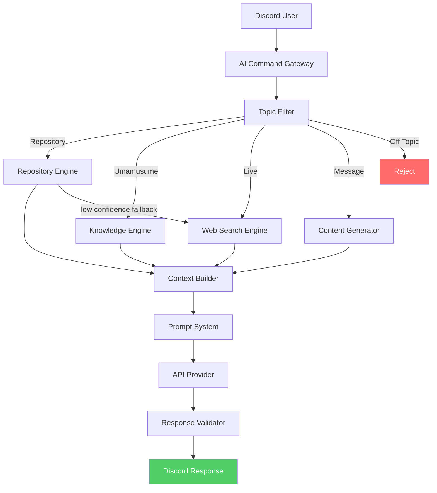
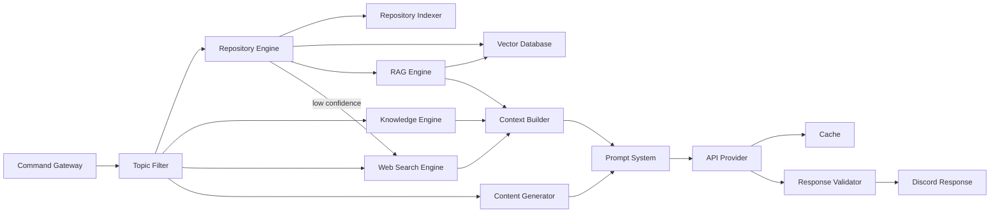

# AI Architecture

**Authority:** `GOVERNANCE/ARCHITECTURE_AUTHORITY.md`
**Registry:** `GOVERNANCE/PIPELINE_REGISTRY.md`
**Department:** Knowledge
**Status:** ACTIVE
**Version:** 1.1.0
**Last Updated:** 2026-07-22

---

## Purpose

This document defines the complete architecture of the Umakraft AI Knowledge Service.

The service is designed as a **read-only intelligence layer** that understands the repository, explains Umamusume mechanics, and generates community content without the ability to modify code, configuration, databases, or Discord operations.

---

## Core Principle

**Read Everything. Change Nothing.**

The AI may:

- Read repository files
- Read source code
- Read documentation
- Read blueprints
- Read governance files
- Read templates
- Read configuration documentation

The AI may **never**:

- Modify files
- Delete files
- Create commits
- Push to GitHub
- Execute shell commands
- Write to databases
- Change Discord settings
- Access secrets or tokens

---

## High-Level Architecture



---

## Service Layers

### Layer 1 — Presentation

Receives Discord interactions and routes them into the AI pipeline.

**Components:**

| Component | Responsibility |
|---|---|
| AI Command Gateway | Parses slash commands, validates input, applies rate limits |
| Topic Filter | Classifies requests as Repository / Umamusume / Message / Off-topic |

**Supported commands:**

```text
/ask <question>
/ai explain <topic>
/ai search <query>
/ai docs <file>
/ai glossary <term>
/ai message <type>
```

---

### Layer 2 — Intelligence

Retrieves and assembles relevant knowledge for the prompt.

**Components:**

| Component | Responsibility |
|---|---|
| Repository Engine | Orchestrates repository scanning, indexing, and search |
| Repository Indexer | Scans files, classifies documents, builds chunks |
| Vector Database | Stores embeddings and performs similarity search |
| RAG Engine | Retrieval-Augmented Generation pipeline |
| Knowledge Engine | Umamusume domain knowledge and glossary |
| Web Search Engine | Live web retrieval via Tavily; fallback for low-confidence local results |
| Context Builder | Assembles chunks from all sources into a coherent prompt context |

---

### Layer 3 — Generation

Builds the prompt and calls the AI provider.

**Components:**

| Component | Responsibility |
|---|---|
| Prompt System | Loads templates, injects variables, builds final prompt |
| API Provider | Abstract layer supporting multiple AI providers |
| Cache | Response cache and embedding cache |

**Supported providers:**

| Provider | Models |
|---|---|
| OpenAI | gpt-4o, gpt-4o-mini, gpt-4-turbo |
| Gemini | gemini-1.5-pro, gemini-1.5-flash |
| Claude | claude-3-5-sonnet, claude-3-haiku |
| OpenRouter | Any model via OpenRouter API |
| Ollama | Any locally hosted model |

---

### Layer 4 — Validation

Validates the AI response before returning it to Discord.

**Components:**

| Component | Responsibility |
|---|---|
| Response Validator | Scope check, grammar, length, prohibited topics, hallucination check |
| Content Generator | Community message generation with length enforcement |

---

## Component Dependency Map



---

## Data Flow

### Repository Question

```text
User: /ask "How does fan gain work?"

1. Command Gateway receives the request
2. Topic Filter classifies: Repository
3. Repository Engine queries the Vector Database
4. RAG Engine retrieves the top-k relevant chunks
5. Context Builder assembles the context window
6. Prompt System injects context into the base prompt
7. API Provider calls the configured AI model
8. Response Validator confirms scope and accuracy
9. Discord receives the response with source citations
```

### Umamusume Knowledge Question

```text
User: /ask "What is MANT?"

1. Command Gateway receives the request
2. Topic Filter classifies: Umamusume
3. Knowledge Engine retrieves the MANT definition
4. Context Builder assembles Umamusume context
5. Prompt System builds the knowledge prompt
6. API Provider calls the configured AI model
7. Response Validator confirms accuracy
8. Discord receives the response
```

### Community Message Generation

```text
User: /ai message greeting

1. Command Gateway receives the request
2. Topic Filter classifies: Message
3. Content Generator selects the Greeting template
4. Prompt System injects template variables
5. API Provider calls the configured AI model
6. Response Validator enforces 100–150 word limit
7. Discord receives the generated message
```

### Live Data Query

```text
User: /ai live "What are the top circles on uma.moe right now?"

1. Command Gateway receives the request
2. Topic Filter classifies: Live (command override)
3. Web Search Engine calls Tavily with scoped query
4. Tavily returns pre-extracted content chunks
5. Context Builder assembles web chunks into context block ([WEB] citation tags)
6. Prompt System builds the prompt
7. API Provider calls the configured AI model
8. Response Validator confirms scope and flags web-sourced content
9. Discord receives the response with [WEB] source citations
```

### Low-Confidence Fallback

```text
User: /ask "What changed in the latest uma.moe update?"

1. Command Gateway receives the request
2. Topic Filter classifies: Repository (keyword match on "uma.moe")
3. Repository Engine queries Vector Database — RAG confidence: 0.48 (below 0.65 threshold)
4. Repository Engine signals Web Search Engine as fallback
5. Web Search Engine calls Tavily with scoped query
6. Context Builder merges RAG chunks + Tavily chunks, sorted by relevance
7. Prompt System builds the prompt with combined context
8. API Provider calls the configured AI model
9. Response Validator checks scope across both source types
10. Discord receives the response with mixed repository and [WEB] citations
```

### Off-Topic Rejection

```text
User: /ask "Who is the president?"

1. Command Gateway receives the request
2. Topic Filter classifies: Off-topic
3. Request is rejected immediately
4. Discord receives a polite rejection message
5. No AI provider call is made
```

---

## Permission Model

### Allowed

```text
✓ Read all repository files
✓ Read source code (.js, .ts, .md, .json, .yaml, .sql)
✓ Read documentation
✓ Read blueprints
✓ Read governance documents
✓ Read configuration documentation
✓ Generate text responses
✓ Generate community messages
✓ Search the repository
✓ Explain code and architecture
```

### Forbidden

```text
✗ Edit any file
✗ Delete any file
✗ Rename any file
✗ Execute shell commands
✗ Run scripts
✗ Commit changes
✗ Push to GitHub
✗ Write to any database
✗ Modify Discord server settings
✗ Access environment secrets or tokens
✗ Call external APIs other than the configured AI provider
```

---

## Quality Controls

### Topic Filter

Enforces repository and Umamusume scope. Rejects:
- General knowledge questions
- Political, financial, medical content
- Unrelated coding questions
- General trivia

### Response Validator

Validates every AI-generated response:
- Confirms the response is scoped to repository or Umamusume content
- Checks grammar and coherence
- Enforces message length limits (100–150 words for generated messages)
- Rejects responses referencing prohibited topics
- Checks for hallucinations against retrieved source documents

### Cache

- Embedding cache: avoids re-embedding identical queries
- Response cache: returns cached answers for repeated identical questions
- TTL: configurable per environment

---

## Advanced Features (Phase 7)

### Conversation Memory

Short-term session memory allowing follow-up questions to reference prior context within the same session. Memory is never persisted across sessions.

### Citation Mode

Every answer appended with a source list:

```text
Sources:
- umamoe/Miner/miner.js (Miner Department)
- GOVERNANCE/ARCHITECTURE_AUTHORITY.md (Article IV)
```

### Confidence Score

Every answer includes a retrieval confidence level:

```text
Confidence: 94% — Repository Documentation
```

### Plugin Architecture

Future extensibility via a plugin registry:

```text
Plugins/
├── RepositoryStats
├── BlueprintValidator
├── DocumentationQA
├── Localization
├── Analytics
└── HallOfFame
```

---

## Architectural Guarantees

The AI subsystem guarantees:

1. **Read-only repository access** — no write path exists in any component
2. **No code modification capability** — enforced at the security layer
3. **Repository-scoped responses** — Topic Filter blocks all out-of-scope requests
4. **Umamusume-scoped knowledge** — Knowledge Engine covers only relevant domain
5. **Automatic off-topic rejection** — immediate rejection before any AI call
6. **Validated message generation** — Response Validator enforces all constraints
7. **Provider abstraction** — any supported provider can be swapped without code changes
8. **Secure context handling** — no secrets appear in any prompt or response
9. **Scalable retrieval architecture** — Vector Database and RAG Engine scale independently
10. **Auditable response pipeline** — every request and response is logged

These guarantees must remain unchanged across all future versions of the architecture.

---

## Related Documents

- `AI/README.md` — overview and navigation
- `AI/IMPLEMENTATION_PLAN.md` — phase-by-phase build plan
- `AI/SECURITY.md` — detailed permission model and enforcement
- `AI/REPOSITORY_ENGINE.md` — repository scanning and indexing
- `AI/RAG_ENGINE.md` — retrieval-augmented generation
- `AI/KNOWLEDGE_ENGINE.md` — Umamusume domain knowledge
- `AI/MESSAGE_SYSTEM.md` — community message generation
- `AI/API_PROVIDER.md` — AI provider abstraction
- `AI/WEB_SEARCH_ENGINE.md` — Tavily integration, live routing, and fallback path
- `GOVERNANCE/ARCHITECTURE_AUTHORITY.md` — supreme law
- `GOVERNANCE/PIPELINE_REGISTRY.md` — official department registry
- `AI/diagrams/Architecture.md` — visual architecture diagram

---

## Version History

- `v1.0.0` — Initial architecture document; five service layers defined; full component dependency map; data flow for all four request types; permission model; architectural guarantees
- `v1.1.0` — Added Web Search Engine (Tavily) to Layer 2; live classification path in high-level diagram and dependency map; live query and low-confidence fallback data flows; five request type data flows total
