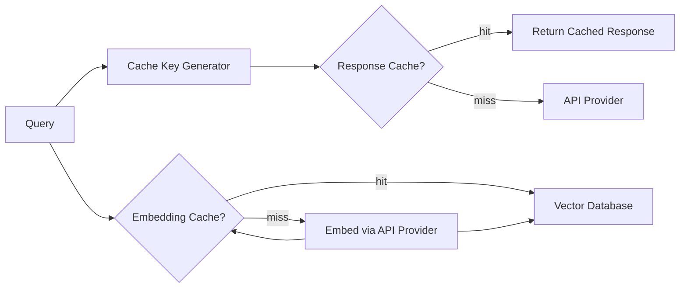

# Cache

**Authority:** `GOVERNANCE/ARCHITECTURE_AUTHORITY.md`
**Registry:** `GOVERNANCE/PIPELINE_REGISTRY.md`
**Department:** Knowledge
**Status:** ACTIVE
**Version:** 1.0.0
**Last Updated:** 2026-07-22

---

## Purpose

The Cache layer reduces AI provider costs and response latency by storing two categories of data: embedding vectors for frequently queried text, and complete validated responses for repeated identical questions. It sits between the API Provider and the rest of the system.

---

## Scope

| In Scope | Out of Scope |
|---|---|
| Embedding cache (query vectors) | Caching source documents (handled by Vector Database) |
| Response cache (validated AI responses) | Session memory (short-term conversation context) |
| Cache key generation | Storing user-specific data |
| TTL enforcement and eviction | Persisting cache across server restarts (in-memory only) |

---

## Responsibilities

- Cache embedding vectors for queries that have been embedded before
- Cache validated AI responses for identical user questions
- Generate deterministic cache keys from query text + classification + variable hash
- Enforce configurable TTL per cache type
- Evict entries on TTL expiry or memory pressure
- Expose cache hit/miss metrics via `core/log.js`
- Never cache responses that failed validation or were hard-rejected

---

## Architecture



---

## Cache Types

### Embedding Cache

Stores query embedding vectors to avoid re-embedding the same text.

| Property | Value |
|---|---|
| Key | SHA-256 of the query text (normalised: lowercased, trimmed) |
| Value | `Float32Array` embedding vector |
| TTL | 60 minutes (configurable: `CACHE_EMBEDDING_TTL_MS`) |
| Max entries | 1,000 (configurable: `CACHE_EMBEDDING_MAX`) |
| Eviction | LRU (least recently used) when max entries reached |

### Response Cache

Stores complete validated AI responses for identical questions.

| Property | Value |
|---|---|
| Key | SHA-256 of (query + classification + variables JSON) |
| Value | Validated response text + source citations + metadata |
| TTL | 10 minutes (configurable: `CACHE_RESPONSE_TTL_MS`) |
| Max entries | 500 (configurable: `CACHE_RESPONSE_MAX`) |
| Eviction | LRU when max entries reached |

Response cache TTL is intentionally short — repository content changes on a regular schedule and cached answers must stay current.

---

## Cache Key Generation

```js
// Embedding cache key
const embeddingKey = sha256(query.toLowerCase().trim());

// Response cache key
const responseKey = sha256(JSON.stringify({
  query: query.toLowerCase().trim(),
  classification: topicClassification,
  variables: sortedVariables  // sorted to ensure key stability
}));
```

---

## Workflow

### Query with Cache Check

```text
1. Incoming query → generate embedding cache key
2. Check embedding cache
   - HIT: use cached vector → proceed to Vector Database search
   - MISS: call API_PROVIDER.embed() → store in embedding cache
3. Generate response cache key
4. Check response cache
   - HIT: return cached response (log cache hit)
   - MISS: run full pipeline → validate → store in response cache
```

### Cache Invalidation

- TTL expiry: handled automatically by the cache store
- Manual: `/ai cache clear` (admin only) flushes both caches
- Re-index trigger: re-indexing the repository does NOT automatically clear the response cache — stale responses may be served until TTL expires

---

## Configuration

```text
CACHE_EMBEDDING_TTL_MS=3600000        # 60 minutes
CACHE_EMBEDDING_MAX=1000
CACHE_RESPONSE_TTL_MS=600000          # 10 minutes
CACHE_RESPONSE_MAX=500
CACHE_ENABLED=true                    # set to false to disable all caching
```

---

## Metrics

Every cache interaction is logged:

```js
{
  timestamp: string,
  cacheType: 'embedding' | 'response',
  event: 'hit' | 'miss' | 'store' | 'evict' | 'expire',
  key: string,     // first 8 chars of the SHA-256 for log readability
  ttlMs: number | null
}
```

Cache hit rate is reported in the Operation health cycle via `core/taskRegistry.js`.

---

## Best Practices

- Never cache responses that failed validation — only store confirmed valid responses
- Never cache responses to off-topic requests (they don't reach the response cache anyway)
- Use a short response TTL — the cost of a cache miss is low; the cost of serving a stale answer is high
- Monitor cache hit rate: a rate below 20% suggests questions are too varied for response caching to help; a rate above 80% may indicate the TTL should be extended

---

## Future Expansion

- Persistent cache (SQLite or Redis) for survival across bot restarts
- Warm cache on startup — pre-embed the most common repository questions
- Per-question cache TTL based on how frequently the underlying source files change
- Cache sharing across multiple bot instances in a scaled deployment

---

## Related Documents

- `AI/API_PROVIDER.md` — embedding generation on cache miss
- `AI/VECTOR_DATABASE.md` — receives cached or fresh embedding vectors
- `AI/RESPONSE_VALIDATOR.md` — only validated responses enter the cache
- `AI/CONFIGURATION.md` — cache configuration variables

---

## Version History

- `v1.0.0` — Initial Cache specification; embedding cache and response cache; LRU eviction; cache key generation; TTL configuration; metrics schema
