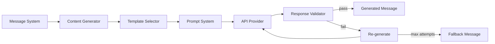

# Content Generator

**Authority:** `GOVERNANCE/ARCHITECTURE_AUTHORITY.md`
**Registry:** `GOVERNANCE/PIPELINE_REGISTRY.md`
**Department:** Knowledge
**Status:** ACTIVE
**Version:** 1.0.0
**Last Updated:** 2026-07-22

---

## Purpose

The Content Generator is the pipeline responsible for producing community-facing messages for the Umakraft Discord server. It receives a message type and optional variables, selects the correct prompt template, calls the API Provider, and validates the output before returning the finished message.

All generated content is between 100 and 150 words. Content must be positive, community-appropriate, and relevant to Umamusume or Umakraft circle activities.

---

## Scope

| In Scope | Out of Scope |
|---|---|
| Seven community message types | Repository question answering |
| Template selection and variable injection | Direct message delivery to Discord |
| 100–150 word length enforcement | Storing messages in Archive |
| Content appropriateness validation | Scheduling message delivery |
| Re-generation on validation failure | Modifying any file |

---

## Responsibilities

- Accept message generation requests from the Message System
- Select the correct prompt template from `AI/prompts/`
- Inject required and optional variables into the template
- Call the Prompt System to assemble the full prompt
- Call the API Provider to generate the message
- Validate length (100–150 words) and content appropriateness via Response Validator
- Trigger re-generation (up to 2 attempts) if validation fails
- Return the validated message to the caller

---

## Architecture



---

## Workflow

1. Message System calls `ContentGenerator.generate(type, variables)`
2. Content Generator validates that `type` is a registered message type
3. Template Selector loads the prompt file from `AI/prompts/<Type>.md`
4. Variables are validated against the template's required variable list
5. Prompt System assembles the full prompt with system constraint block
6. API Provider generates the message text
7. Response Validator checks word count (100–150) and content appropriateness
8. If validation passes, the message is returned
9. If validation fails:
   - Attempt 1 failure → re-generate with a correction instruction appended to the prompt
   - Attempt 2 failure → return a pre-written fallback message for the type

---

## Technical Design

### Message Types and Templates

| Type | Template | Required Variables | Optional Variables |
|---|---|---|---|
| `greeting` | `prompts/Greeting.md` | none | `circleName`, `date` |
| `milestone` | `prompts/Milestone.md` | `trainerName`, `milestoneValue` | `circleName`, `previousMilestone` |
| `achievement` | `prompts/Achievement.md` | `trainerName`, `achievementName` | `circleName`, `description` |
| `leaderboard` | `prompts/Leaderboard.md` | `topTrainers` (array) | `period`, `circleName` |
| `warning` | `prompts/Warning.md` | `trainerName`, `deficitAmount` | `circleName`, `deadline` |
| `reminder` | `prompts/Reminder.md` | `eventName`, `eventDate` | `circleName`, `details` |
| `documentation` | `prompts/Documentation.md` | `topic` | `context`, `audience` |

### Length Enforcement

```text
Target: 100–150 words
Under 100: re-generate with "Please expand your response to at least 100 words."
Over 150:  re-generate with "Please condense your response to at most 150 words."
Max attempts: 2 (then use fallback)
```

### Fallback Messages

Each type has a pre-written fallback for when both generation attempts fail. Fallbacks are stored in the template files under a `## Fallback` section.

### Content Appropriateness Checks

The Response Validator applies:
- No prohibited topics (politics, violence, explicit content)
- No out-of-scope content (unrelated games, external URLs)
- No mention of API keys, secrets, or system internals
- Positive, community-appropriate tone

---

## Examples

### Milestone Generation

**Input:**
```js
{
  type: 'milestone',
  variables: {
    trainerName: 'TrainerAkira',
    milestoneValue: 500000,
    circleName: 'Rising Stars'
  }
}
```

**Generated output:**
> 🎉 Congratulations to **TrainerAkira** on reaching **500,000 fans** — a massive milestone that reflects months of dedication and consistent training! The entire *Rising Stars* circle is proud of this achievement. Your commitment inspires every member to push harder and aim higher. Keep up the incredible work, and here's to the next milestone! The circle grows stronger with every trainer who reaches new heights. Well done! 🌟

**Word count:** 67 — below 100, re-generation triggered with expansion instruction.

---

## Best Practices

- Always validate required variables before calling the Prompt System — return a clear error if variables are missing
- Log every generation attempt with type, word count, and pass/fail outcome
- Use the cheapest capable model for message generation — quality is important but these messages are short
- Test all seven message types in the test suite before deployment
- Review fallback messages quarterly to ensure they remain appropriate

---

## Future Expansion

- Message history tracking to avoid repeating the same phrasing within a session
- Style variants (formal, casual, energetic) selectable per circle
- Multi-language generation
- Integration with Broadcast Archive to avoid duplicating recently sent messages
- Batch generation for generating multiple message variants for A/B testing

---

## Related Documents

- `AI/MESSAGE_SYSTEM.md` — message type registry and routing
- `AI/PROMPT_SYSTEM.md` — prompt assembly
- `AI/RESPONSE_VALIDATOR.md` — length and content validation
- `AI/API_PROVIDER.md` — AI model call
- `AI/prompts/` — all seven prompt templates
- `AI/EXAMPLES.md` — sample generated messages

---

## Version History

- `v1.0.0` — Initial Content Generator specification; seven message types; variable schema; 100–150 word enforcement with re-generation; fallback mechanism; content appropriateness checks
