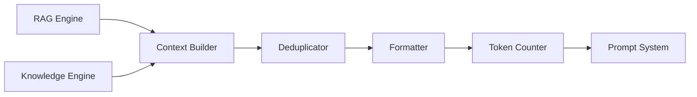

# Context Builder

**Authority:** `GOVERNANCE/ARCHITECTURE_AUTHORITY.md`
**Registry:** `GOVERNANCE/PIPELINE_REGISTRY.md`
**Department:** Knowledge
**Status:** ACTIVE
**Version:** 1.0.0
**Last Updated:** 2026-07-22

---

## Purpose

The Context Builder assembles the context window that is passed to the Prompt System. It receives ranked document chunks from the RAG Engine (for repository questions) or structured knowledge entries from the Knowledge Engine (for Umamusume questions), formats them into a coherent context block, and enforces the token budget before handing off to the Prompt System.

The quality of the context window directly determines the quality of the AI response.

---

## Scope

| In Scope | Out of Scope |
|---|---|
| Assembling ranked RAG chunks into a context block | Retrieving chunks (RAG Engine) |
| Formatting Umamusume knowledge entries | Prompt template loading |
| Enforcing token budget | AI model calls |
| Attaching source citations to each chunk | Response validation |
| Deduplicating overlapping chunks | Caching context windows |

---

## Responsibilities

- Receive ranked chunks from the RAG Engine or structured entries from the Knowledge Engine
- Deduplicate chunks that share the same file path and heading
- Format each chunk with its source citation header
- Assemble chunks in descending relevance order
- Enforce the token budget by trimming lowest-relevance chunks when needed
- Pass the assembled context block to the Prompt System as `{{context}}`

---

## Architecture



---

## Workflow

1. RAG Engine delivers ranked chunks (repository mode) or Knowledge Engine delivers entries (Umamusume mode)
2. Context Builder deduplicates: if two chunks share the same file path and heading, only the higher-relevance one is kept
3. Chunks are sorted in descending relevance order
4. Each chunk is wrapped in a citation header block
5. Token Counter estimates total context tokens
6. If over budget: lowest-relevance chunks are trimmed until within budget
7. If under minimum chunks (3): the budget check is relaxed to preserve at least 3 chunks
8. Assembled context block is passed to Prompt System as `{{context}}`

---

## Technical Design

### Context Block Format

Each chunk is formatted as:

```text
---
Source: umamoe/Vault/vault.js
Section: isTrusted() — Trust check
Relevance: 0.94
---
The Vault only accepts Inspector-approved envelopes.
Envelope must have { success: true, accepted: true, data, inspectedAt }.
---
```

### Full Context Block Structure

```text
[SOURCE 1 — highest relevance]
---
Source: <filePath>
Section: <heading>
Relevance: <score>
---
<content>
---

[SOURCE 2]
---
...
---

[SOURCE N — lowest relevance]
---
...
---
```

### Deduplication Rule

Two chunks are considered duplicates if:
- They share the same `filePath` AND
- They share the same `heading` (or both have `null` heading)

When duplicates are found, the chunk with the higher relevance score is retained.

### Token Budget

Context token budget is determined by the Prompt System's configured token limit minus the estimated tokens for the system constraint block, template instructions, the user question, and the response reservation:

```text
Token budget = provider_context_window
             - system_constraint_tokens (≈ 200)
             - template_tokens (≈ 300)
             - question_tokens (≈ 50)
             - response_reservation (2000)
             = available_context_tokens
```

Default available context tokens for gpt-4o-mini: ~125,450.

In practice, the RAG Engine limits top-k to 8 chunks and each chunk to 1200 characters, so the context window rarely exceeds 10,000 tokens.

### Minimum Context Guarantee

Even when trimming is needed, at least 3 chunks are always returned:

```text
if total_tokens > budget AND chunk_count > 3:
    trim lowest-relevance chunks until within budget
    but never trim below 3 chunks
```

---

## Examples

### Assembled Context for "How does the Vault reject untrusted data?"

```text
---
Source: umamoe/Vault/vault.js
Section: isTrusted() — Trust check
Relevance: 0.94
---
The Vault only accepts Inspector-approved envelopes.
Envelope must have { success: true, accepted: true, data, inspectedAt }.
---

---
Source: INFRASTRUCTURE/Contracts/contract.md
Section: Trusted envelope (Inspector -> Vault)
Relevance: 0.88
---
{ trustedData: { id, ...normalized fields... }, metadata: { source, endpoint, inspectedAt, storedAt } }
---

---
Source: umamoe/Inspector/inspector.js
Section: Inspection result
Relevance: 0.81
---
Inspector returns { success, accepted, data, inspectedAt } on approval...
---
```

---

## Best Practices

- Always sort chunks by descending relevance before formatting — the AI model pays more attention to content near the top of the context window
- Log the final chunk count and total token estimate for every assembled context
- When trimming is triggered, log which chunks were removed and why
- Test deduplication with overlapping chunk fixtures in the test suite

---

## Future Expansion

- Cross-chunk coherence scoring — prefer sets of chunks that reference each other
- Hierarchical context — parent document summary + child chunk detail
- Conversation memory injection — include prior turn context in the window
- Source diversity enforcement — ensure context includes chunks from at least 2 different files when possible

---

## Related Documents

- `AI/RAG_ENGINE.md` — provides ranked chunks
- `AI/KNOWLEDGE_ENGINE.md` — provides Umamusume knowledge entries
- `AI/PROMPT_SYSTEM.md` — receives the assembled context block
- `AI/VECTOR_DATABASE.md` — original source of chunk data
- `AI/diagrams/Sequence.md` — full request sequence including Context Builder

---

## Version History

- `v1.0.0` — Initial Context Builder specification; chunk formatting; deduplication rule; token budget enforcement; minimum context guarantee; context block format
