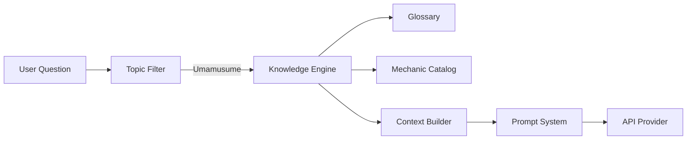

# Knowledge Engine

**Authority:** `GOVERNANCE/ARCHITECTURE_AUTHORITY.md`
**Registry:** `GOVERNANCE/PIPELINE_REGISTRY.md`
**Department:** Knowledge
**Status:** ACTIVE
**Version:** 1.0.0
**Last Updated:** 2026-07-22

---

## Purpose

The Knowledge Engine is the domain knowledge authority for Umamusume: Pretty Derby. It holds structured knowledge about game mechanics, terminology, trainer rankings, fan systems, circle structures, and Umamusume-specific concepts that may not be present in the repository itself.

While the Repository Engine answers questions about the codebase, the Knowledge Engine answers questions about the game the codebase serves.

---

## Scope

| In Scope | Out of Scope |
|---|---|
| Umamusume game mechanics | General horse racing trivia |
| Fan gain and circle rank systems | Anime episode summaries |
| Trainer rankings and levels | Out-of-game merchandise |
| Skill card mechanics | Political or financial topics |
| MANT definitions and thresholds | Competitor game mechanics |
| Uma.moe API data concepts | General Japanese culture (unless Umamusume-specific) |
| Circle structures and roles | |
| Glossary of Umamusume terms | |

---

## Responsibilities

- Maintain a structured glossary of Umamusume terms
- Answer questions about game mechanics with accurate definitions
- Classify whether a question is Umamusume-domain vs. off-topic
- Provide structured context to the Context Builder for Umamusume questions
- Never speculate — if a term or mechanic is unknown, say so explicitly

---

## Architecture



---

## Workflow

1. Topic Filter routes a question classified as Umamusume to the Knowledge Engine
2. Knowledge Engine searches the Glossary for exact term matches
3. Knowledge Engine searches the Mechanic Catalog for concept matches
4. Matched entries are passed to the Context Builder as structured knowledge
5. The Context Builder assembles the Umamusume context window
6. The Prompt System builds a knowledge-mode prompt
7. The API Provider generates the response

---

## Technical Design

### Glossary Schema

```js
{
  term: string,            // e.g. "MANT"
  aliases: string[],       // e.g. ["Monthly Average New Trainers"]
  definition: string,      // short, accurate definition
  category: string,        // e.g. "Ranking", "Mechanic", "Social"
  relatedTerms: string[],  // e.g. ["fan gain", "circle rank"]
  source: string           // e.g. "uma.moe API", "game mechanic"
}
```

### Core Glossary Terms

| Term | Category | Definition |
|---|---|---|
| MANT | Ranking | Monthly Average New Trainers — the primary circle health metric |
| Fan Gain | Mechanic | The number of new fans a trainer earns in a time period |
| Circle Rank | Social | A circle's standing based on aggregate member fan gain |
| Trainer Level | Mechanic | A trainer's progression level within the game |
| Fan Deficit | Mechanic | The gap between a trainer's actual and projected fan count |
| Milestone | Achievement | A fan count threshold that triggers a special announcement |
| Blueprint | Repository | A Workshop rendering template for a specific card type |
| Circle | Social | A group of trainers competing together as a team |
| Depot | Repository | Refinery storage for compiled trainer products |
| Vault | Repository | Umamoe storage for validated raw trainer data |

### Mechanic Catalog

Each game mechanic is described with:

```js
{
  name: string,
  description: string,
  formula: string | null,      // if calculable
  thresholds: object | null,   // tier definitions if applicable
  examples: string[],
  relatedMechanics: string[]
}
```

---

## Examples

### Glossary Lookup

**Input:** `/ai glossary MANT`

**Response:**
> MANT stands for Monthly Average New Trainers. It measures the average number of new trainers added to a circle each month and is the primary metric used to evaluate circle health and rank. A circle with a higher MANT attracts more competitive trainers and earns higher circle rank rewards.

### Mechanic Explanation

**Input:** `/ask "How is fan deficit calculated?"`

**Response:**
> Fan deficit is the difference between a trainer's projected fan count (based on their historical growth rate) and their actual current fan count. If a trainer typically gains 10,000 fans per month but has only gained 6,000 this month, they have a deficit of 4,000 fans. The Broadcast stage monitors deficits and triggers warning announcements when a trainer falls significantly behind their projection.

---

## Best Practices

- Always define terms precisely — avoid vague explanations
- When a term has multiple meanings in different contexts, address all of them
- Cross-reference Umamusume concepts with their repository equivalents (e.g. fan gain → `Refinery/Refiner/refiner.js`)
- If a question cannot be answered with confidence, respond with "I don't have reliable information about that" rather than guessing
- Keep glossary definitions under 3 sentences for quick lookups

---

## Future Expansion

- Integration with live uma.moe API for up-to-date game data
- Automatic glossary updates from repository documentation changes
- Trainer and circle lookup by name
- Historical fan gain trend explanations
- Skill card database and explanation system

---

## Related Documents

- `AI/ARCHITECTURE.md` — full system architecture
- `AI/TOPIC_FILTER.md` — Umamusume scope classification
- `AI/CONTEXT_BUILDER.md` — context assembly
- `AI/REPOSITORY_ENGINE.md` — repository-side counterpart
- `AI/EXAMPLES.md` — sample Knowledge Engine interactions

---

## Version History

- `v1.0.0` — Initial Knowledge Engine specification; glossary schema; mechanic catalog; ten core terms defined; scope boundaries established
