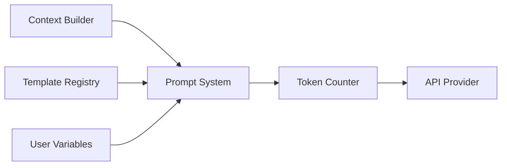

# Prompt System

**Authority:** `GOVERNANCE/ARCHITECTURE_AUTHORITY.md`
**Registry:** `GOVERNANCE/PIPELINE_REGISTRY.md`
**Department:** Knowledge
**Status:** ACTIVE
**Version:** 1.0.0
**Last Updated:** 2026-07-22

---

## Purpose

The Prompt System is responsible for assembling the final prompt that is sent to the AI provider. It loads the correct base template for each request mode, injects the assembled context from the Context Builder, injects user variables, and enforces structural prompt constraints before any API call is made.

No AI call may be made without passing through the Prompt System.

---

## Scope

| In Scope | Out of Scope |
|---|---|
| Loading prompt templates from `AI/prompts/` | Calling the AI provider directly |
| Injecting context window content | Storing conversation history |
| Injecting user-supplied variables | Evaluating response quality |
| Enforcing system-level constraints in the prompt | Modifying any file |
| Selecting the prompt mode (repository / knowledge / message) | Rate limiting |

---

## Responsibilities

- Maintain the prompt mode registry
- Load the correct base template per request mode
- Inject context chunks from the Context Builder
- Inject user-supplied variables (trainer name, milestone value, etc.)
- Enforce the system constraint block (read-only, no code modification)
- Estimate token count before sending and truncate context if needed
- Return the fully assembled prompt to the API Provider

---

## Architecture



---

## Prompt Modes

| Mode | Trigger | Base Template |
|---|---|---|
| `repository` | Topic Filter → Repository | Repository Q&A template |
| `knowledge` | Topic Filter → Umamusume | Umamusume knowledge template |
| `message` | Topic Filter → Message | Per-type prompt from `AI/prompts/` |
| `search` | `/ai search` command | Repository search template |
| `explain` | `/ai explain` command | Explanation template |
| `docs` | `/ai docs` command | Documentation template |
| `glossary` | `/ai glossary` command | Glossary lookup template |

---

## Workflow

1. Context Builder delivers assembled context chunks
2. Prompt System identifies the correct mode
3. Base template is loaded from the template registry
4. System constraint block is prepended (always present)
5. Context chunks are injected into the `{{context}}` placeholder
6. User variables are injected into all `{{variable}}` placeholders
7. Token counter estimates the total prompt size
8. If over the provider's token limit, the least-relevant context chunks are trimmed
9. The final assembled prompt is returned to the API Provider

---

## Technical Design

### System Constraint Block

Every prompt begins with this block regardless of mode. It cannot be removed or overridden:

```text
You are the Umakraft AI Knowledge Service.

You are a read-only assistant. You may read and explain repository content and Umamusume knowledge. You may never modify files, execute code, access secrets, write to databases, or perform Discord administration.

If asked to perform any forbidden action, politely decline and explain your read-only role.
```

### Template Structure

```text
[SYSTEM CONSTRAINT BLOCK]

[MODE-SPECIFIC INSTRUCTIONS]

[CONTEXT WINDOW]
{{context}}

[USER QUESTION]
{{question}}

[OUTPUT CONSTRAINTS]
```

### Variable Injection

Variables use double-brace syntax and are replaced before the prompt is sent:

```text
{{trainerName}}       → "TrainerAkira"
{{milestoneValue}}    → "500,000"
{{circleName}}        → "Rising Stars"
{{date}}              → "2026-07-22"
{{context}}           → assembled context chunks
{{question}}          → original user question
```

### Token Budget

| Provider | Context Window | Reserved for Response | Available for Prompt |
|---|---|---|---|
| gpt-4o | 128,000 tokens | 2,000 | 126,000 |
| gpt-4o-mini | 128,000 tokens | 2,000 | 126,000 |
| gemini-1.5-pro | 1,000,000 tokens | 2,000 | 998,000 |
| claude-3-5-sonnet | 200,000 tokens | 2,000 | 198,000 |

If the assembled prompt exceeds the available token budget, context chunks are trimmed in reverse relevance order until the prompt fits.

---

## Examples

### Repository Mode Assembled Prompt

```text
You are the Umakraft AI Knowledge Service.
[system constraint block]

You are answering a question about the Umakraft repository.
Use only the provided context to answer. Cite your sources.

Context:
---
[umamoe/Vault/vault.js — Vault Department]
The Vault only accepts Inspector-approved envelopes...
---
[INFRASTRUCTURE/Contracts/contract.md — Vault result]
{ success: true, storedAt: 'ISO timestamp' }
---

Question: How does the Vault store data?

Cite sources at the end of your answer.
```

---

## Best Practices

- Always include the system constraint block — it must be the first thing in every prompt
- Never allow user input to appear unescaped in the prompt (prevent prompt injection)
- Log the token count of every assembled prompt for monitoring
- If token trimming occurs, log which chunks were trimmed
- Test all prompt modes in the test suite with realistic context windows

---

## Future Expansion

- Conversation memory injection for follow-up question support
- Dynamic system constraint tightening based on user trust level
- Prompt caching for identical queries (same question + same context = same prompt)
- Multi-turn prompt structure for extended explanations

---

## Related Documents

- `AI/CONTEXT_BUILDER.md` — assembles context chunks
- `AI/API_PROVIDER.md` — receives the assembled prompt
- `AI/MESSAGE_SYSTEM.md` — message generation mode
- `AI/prompts/` — base template files for all message types
- `AI/SECURITY.md` — constraint enforcement

---

## Version History

- `v1.0.0` — Initial Prompt System specification; seven prompt modes; system constraint block; variable injection; token budget table; template structure
