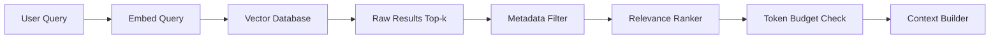

# RAG Engine

**Authority:** `GOVERNANCE/ARCHITECTURE_AUTHORITY.md`
**Registry:** `GOVERNANCE/PIPELINE_REGISTRY.md`
**Department:** Knowledge
**Status:** ACTIVE
**Version:** 1.0.0
**Last Updated:** 2026-07-22

---

## Purpose

The RAG Engine (Retrieval-Augmented Generation) is the retrieval pipeline that bridges the Vector Database and the Context Builder. When a repository question arrives, the RAG Engine embeds the query, searches the vector database for the most relevant document chunks, ranks them by relevance, and passes the ranked results to the Context Builder for assembly into a prompt context window.

RAG ensures that AI responses are grounded in actual repository content rather than the model's training data — making answers accurate, current, and citable.

---

## Scope

| In Scope | Out of Scope |
|---|---|
| Query embedding | Prompt assembly |
| Similarity search in Vector Database | AI model calls |
| Result ranking by relevance score | Document indexing (handled by Repository Indexer) |
| Metadata filtering (department, file type) | Umamusume knowledge retrieval (handled by Knowledge Engine) |
| Context chunk selection within token budget | Response validation |

---

## Responsibilities

- Embed the incoming query using the API Provider's embedding model
- Search the Vector Database for the top-k most similar chunks
- Apply metadata filters when the request is scoped (e.g. governance-only, commands-only)
- Rank results by relevance score
- Trim result set to fit within the context token budget
- Attach source citations (file path, section heading, relevance score) to each chunk
- Return the ranked chunk list to the Context Builder

---

## Architecture



---

## Workflow

### Standard Repository Query

1. User question arrives from the Topic Filter (classified as Repository)
2. RAG Engine calls `API_PROVIDER.embed(question)` to produce a query vector
3. Vector Database performs cosine similarity search and returns the top-k=8 results
4. Metadata Filter removes any chunks from excluded file types or directories
5. Results are sorted by descending relevance score
6. Token Budget Check trims from the lowest-relevance end until the chunk list fits
7. Each chunk is annotated with: file path, heading, relevance score (0.0–1.0)
8. Annotated chunks are passed to the Context Builder

### Scoped Query

When the user specifies a scope (e.g. `/ai search "fan gain" --scope governance`):

1. Steps 1–4 above
2. Metadata Filter additionally filters to the requested scope
3. If fewer than 3 results remain after filtering, the scope restriction is relaxed and a note is added to the response

---

## Technical Design

### Similarity Metric

Cosine similarity between the query embedding and each stored document chunk embedding.

```text
Score: 0.0 → completely unrelated
Score: 0.5 → partially related
Score: 0.85+ → highly relevant
Score: 1.0 → identical
```

Minimum threshold: `0.60` — chunks below this score are excluded regardless of rank.

### Top-k Configuration

These parameters are loaded from environment variables defined in `AI/CONFIGURATION.md`:

| Environment Variable | Default | Description |
|---|---|---|
| `VDB_TOP_K` | 8 | Maximum chunks retrieved before filtering |
| `VDB_MIN_SCORE` | 0.60 | Minimum relevance score to include a chunk |
| `RAG_MAX_CONTEXT_TOKENS` | 6000 | Token budget for the context window (tokens) |
| `RAG_MIN_CHUNKS` | 3 | Minimum chunks returned even if some fall below threshold |

### Result Schema

```js
{
  chunkId: string,
  filePath: string,       // e.g. "umamoe/Vault/vault.js"
  heading: string | null, // nearest heading in source document
  department: string,     // e.g. "Umamoe"
  content: string,        // raw chunk text
  score: number,          // 0.0–1.0 cosine similarity
  tokenCount: number      // estimated tokens in this chunk
}
```

### Metadata Filters

Available filter dimensions:

| Filter | Values |
|---|---|
| `department` | `Umamoe`, `Refinery`, `Workshop`, `Broadcast`, `Distribution`, `Operation`, `AI`, `GOVERNANCE`, `core` |
| `fileType` | `Markdown`, `JavaScript`, `JSON`, `YAML` |
| `scope` | `governance`, `commands`, `blueprints`, `source`, `documentation` |

---

## Examples

### Query: "How does the Vault reject untrusted data?"

**Embedded query vector:** `[0.12, -0.34, 0.89, ...]`

**Top results:**

| Rank | File | Heading | Score |
|---|---|---|---|
| 1 | `umamoe/Vault/vault.js` | `isTrusted()` | 0.94 |
| 2 | `INFRASTRUCTURE/Contracts/contract.md` | Trusted envelope | 0.88 |
| 3 | `umamoe/Inspector/inspector.js` | Inspection result | 0.81 |
| 4 | `GOVERNANCE/ARCHITECTURE_AUTHORITY.md` | Article VI | 0.72 |

**Token count:** 1,240 — within budget, all 4 chunks returned.

---

## Best Practices

- Use the same embedding model for both indexing and querying — a mismatch produces meaningless scores
- Log retrieval metrics (top score, chunk count, token total) for every query
- Re-index documents whose checksum has changed before the next retrieval cycle
- Never hard-code a relevance threshold into business logic — always use the `RAG_MIN_SCORE` configuration variable
- Return at least `RAG_MIN_CHUNKS` results even if some fall below the threshold, to prevent empty responses

---

## Future Expansion

- Hybrid search: combine semantic similarity with BM25 keyword scoring
- Re-ranking using a cross-encoder model for improved precision
- Query expansion: automatically broaden the query if fewer than 3 chunks are found
- Feedback loop: track which chunks were cited in accepted answers to improve ranking

---

## Related Documents

- `AI/VECTOR_DATABASE.md` — embedding storage and similarity search
- `AI/REPOSITORY_INDEXER.md` — document indexing pipeline
- `AI/CONTEXT_BUILDER.md` — assembles chunks into prompt context
- `AI/REPOSITORY_ENGINE.md` — orchestrates the full retrieval pipeline
- `AI/API_PROVIDER.md` — provides the embedding model
- `AI/diagrams/Repository Flow.md` — visual retrieval flow

---

## Version History

- `v1.0.0` — Initial RAG Engine specification; cosine similarity; top-k=8; metadata filters; result schema; token budget enforcement; minimum threshold 0.60
- `v1.1.0` — Config variable names corrected to match CONFIGURATION.md: `RAG_TOP_K` → `VDB_TOP_K`, `RAG_MIN_SCORE` → `VDB_MIN_SCORE`; `RAG_MAX_CONTEXT_TOKENS` and `RAG_MIN_CHUNKS` kept with matching entries added to CONFIGURATION.md
