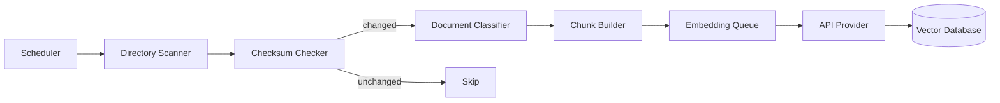

# Repository Indexer

**Authority:** `GOVERNANCE/ARCHITECTURE_AUTHORITY.md`
**Registry:** `GOVERNANCE/PIPELINE_REGISTRY.md`
**Department:** Knowledge
**Status:** ACTIVE
**Version:** 1.0.0
**Last Updated:** 2026-07-22

---

## Purpose

The Repository Indexer is the entry point for making the repository searchable. It scans all non-excluded files, classifies each document by type and department, splits documents into retrieval-optimised chunks, generates embeddings via the API Provider, and stores the results in the Vector Database.

The Indexer runs on startup and on a configurable schedule. It never writes to any source file — its only output is entries in the Vector Database.

---

## Scope

| In Scope | Out of Scope |
|---|---|
| Recursive directory scan | Modifying source files |
| File type classification | Generating AI responses |
| Heading-aware chunking | Similarity search (RAG Engine) |
| Checksum-based incremental update detection | Prompt assembly |
| Embedding generation via API Provider | Serving Discord requests |
| Vector Database upsert | |

---

## Responsibilities

- Scan the repository on startup (full index if database is empty)
- Detect file changes using SHA-256 checksums
- Classify files by type and owning department
- Split files into chunks at heading and paragraph boundaries
- Generate embeddings for each chunk via `API_PROVIDER.embed()`
- Upsert chunks into the Vector Database
- Log all indexing activity, including errors, without failing the entire run
- Delete embeddings for files that have been removed from the repository

---

## Architecture



---

## Workflow

### Full Index Run

1. Scheduler triggers a full index (on startup or manual request)
2. Directory Scanner walks all non-excluded directories recursively
3. For each file, Checksum Checker computes SHA-256 and compares to the stored checksum
4. Files with changed checksums (or no stored checksum) proceed to Document Classifier
5. Document Classifier assigns file type and department
6. Chunk Builder splits the document into 500–1200 character chunks with heading context
7. Each chunk is added to the Embedding Queue
8. Embedding Queue calls `API_PROVIDER.embed(chunk.content)` for each chunk
9. The resulting vector + metadata is upserted to the Vector Database
10. Files no longer present in the repository have their embeddings deleted

### Incremental Index Run

Same as above, but only files with changed checksums are processed. Unchanged files are skipped entirely.

---

## Technical Design

### Supported File Types

| Type | Extensions | Chunking Strategy |
|---|---|---|
| Markdown | `.md` | Split at `##` and `###` headings; fall back to paragraph (blank line) |
| JavaScript | `.js` | Split at function/class boundaries; include JSDoc comment with each chunk |
| JSON | `.json` | Split at top-level key boundaries |
| YAML | `.yaml`, `.yml` | Split at top-level key boundaries |
| SQL | `.sql` | Split at statement boundaries |
| Plain text | `.txt` | Split at paragraph boundaries |

### Exclusion Rules

Files and directories excluded from indexing:

```text
node_modules/
.git/
.local/
attached_assets/
dist/
coverage/
*.log
*.env
*.env.*
*.lock
*.key
*.pem
```

### Chunk Builder

```text
Noise floor:     Chunks under INDEXER_CHUNK_MIN_CHARS (default: 50) characters
                 are silently skipped — they are too short to be meaningful.
                 This is a discard threshold, not a target minimum.

Target size:     INDEXER_CHUNK_TARGET_CHARS (default: 800) characters
Allowed range:   INDEXER_CHUNK_MIN_CHARS (50) — INDEXER_CHUNK_MAX_CHARS (1200)
Overlap:         INDEXER_CHUNK_OVERLAP_CHARS (default: 100) characters between adjacent chunks
Boundary:        Prefer heading > paragraph > sentence
Heading context: The nearest heading above the chunk is stored in chunk.heading
```

**Clarification:** `INDEXER_CHUNK_MIN_CHARS` (50) is a post-split noise filter. Any fragment produced by the chunker that is shorter than 50 characters is discarded before embedding. It does not mean 50-character chunks are valid targets — the target range is 500–1200 characters.

### Department Classification

| Directory prefix | Department |
|---|---|
| `umamoe/` | Umamoe |
| `Refinery/` | Refinery |
| `Workshop/` | Workshop |
| `Distribution/` | Distribution |
| `Broadcast/` | Broadcast |
| `Operation/` | Operation |
| `AI/` | AI |
| `GOVERNANCE/` | Governance |
| `INFRASTRUCTURE/` | Infrastructure |
| `core/` | Core |
| `tasks/` | Core |
| Root level | Root |

### Embedding Queue

The queue processes embeddings with:
- Concurrency: up to 5 parallel embedding calls (configurable via `INDEXER_EMBED_CONCURRENCY`)
- Rate limit: respects `AI_RATE_LIMIT_RPM` from the API Provider
- Error handling: a failed embedding logs a warning and skips the chunk (does not abort the run)

---

## Metadata per Chunk

```js
{
  filePath: string,         // relative path from repo root
  chunkIndex: number,       // 0-based position within file
  heading: string | null,   // nearest heading above the chunk
  department: string,
  fileType: string,
  content: string,          // raw chunk text
  tokenCount: number,       // estimated as Math.ceil(content.length / 4)
                            // (1 token ≈ 4 characters for English/code text).
                            // No tokenizer dependency required.
  checksum: string,         // SHA-256 of the full source file
  indexedAt: Date
}
```

---

## Scheduling

| Event | Index Type |
|---|---|
| Bot startup (empty VDB) | Full index |
| Bot startup (VDB populated) | Incremental (checksum diff) |
| Every 6 hours (configurable) | Incremental |
| Manual `/ai reindex` (admin) | Full index |
| Manual `/ai reindex --clean` (admin) | Clean slate — delete all, full re-index |

---

## Examples

### Log Output for an Incremental Run

All logging uses `core/log.js` — output is newline-delimited JSON to stdout:

```json
{"timestamp":"2026-07-22T09:00:00.000Z","level":"info","message":"[Indexer] incremental run — 142 files to check"}
{"timestamp":"2026-07-22T09:00:00.012Z","level":"info","message":"[Indexer] 6 files changed since last index"}
{"timestamp":"2026-07-22T09:00:00.023Z","level":"info","message":"[Indexer] chunking umamoe/Miner/miner.js — 4 chunks"}
{"timestamp":"2026-07-22T09:00:00.034Z","level":"info","message":"[Indexer] chunking GOVERNANCE/ARCHITECTURE_AUTHORITY.md — 11 chunks"}
{"timestamp":"2026-07-22T09:00:01.100Z","level":"info","message":"[Indexer] embedding queue complete — 41 chunks upserted"}
{"timestamp":"2026-07-22T09:00:01.105Z","level":"info","message":"[Indexer] incremental index complete — duration=3.2s"}
```

---

## Best Practices

- Never abort the entire index run on a single file error — log and continue
- Track the last successful full index timestamp so incremental runs can fall back to full if too many files have changed
- Validate chunk sizes before embedding — chunks under 50 characters are typically noise and should be skipped
- Log the total chunk count, skipped files, and duration for every run

---

## Future Expansion

- File change event watcher for near-real-time incremental indexing
- Git diff-aware indexing — re-index only files changed in the latest commit
- Duplicate chunk detection — skip identical chunks across different files
- Indexing health report — percentage of repository covered, last indexed timestamps per department

---

## Related Documents

- `AI/VECTOR_DATABASE.md` — stores the indexed embeddings
- `AI/RAG_ENGINE.md` — queries the indexed embeddings
- `AI/REPOSITORY_ENGINE.md` — orchestrates the full indexing + retrieval pipeline
- `AI/API_PROVIDER.md` — generates embeddings
- `AI/CONFIGURATION.md` — indexer configuration variables
- `AI/diagrams/Repository Flow.md` — visual indexing flow

---

## Version History

- `v1.0.0` — Initial Repository Indexer specification; six supported file types; exclusion rules; heading-aware chunking; department classification table; scheduling triggers; embedding queue with concurrency control
- `v1.1.0` — Log output example updated to show actual `core/log.js` JSON format (newline-delimited JSON, not plain-text prefix format)
- `v1.2.0` — Chunk Builder clarified: `INDEXER_CHUNK_MIN_CHARS` (50) documented as a noise-discard floor, not a target minimum; `tokenCount` estimation method specified as `Math.ceil(content.length / 4)`
