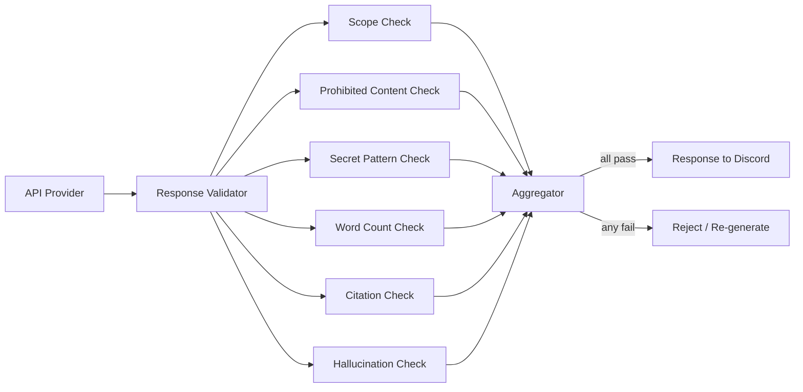

# Response Validator

**Authority:** `GOVERNANCE/ARCHITECTURE_AUTHORITY.md`
**Registry:** `GOVERNANCE/PIPELINE_REGISTRY.md`
**Department:** Knowledge
**Status:** ACTIVE
**Version:** 1.0.0
**Last Updated:** 2026-07-22

---

## Purpose

The Response Validator is the final quality and safety gate before any AI-generated response reaches a Discord user. It inspects every response for scope compliance, length, grammar, prohibited content, hallucination risk, and source citation availability. A response that fails any mandatory check is either corrected or replaced with a safe fallback.

---

## Scope

| In Scope | Out of Scope |
|---|---|
| Repository scope confirmation | Retrieving source content |
| Umamusume scope confirmation | Generating the response |
| Word count enforcement (messages) | Prompt assembly |
| Prohibited topic detection | Logging to Discord |
| Secret pattern detection | Caching responses |
| Hallucination indicator detection | |
| Citation availability check (repository mode) | |
| Output formatting validation | |

---

## Responsibilities

- Confirm the response is scoped to the classification from the Topic Filter
- Detect and reject responses containing prohibited content
- Detect and reject responses containing secret patterns
- Enforce 100–150 word count for message-type responses
- Check that repository-mode responses include at least one source citation
- Flag responses with high hallucination risk (e.g. claims about external URLs or systems)
- Return pass/fail with a structured reason so the caller can trigger re-generation

---

## Architecture



---

## Validation Checks

### 1. Scope Check

Confirms the response content is consistent with the classified topic.

| Classification | Scope Rule |
|---|---|
| `repository` | Response must reference Umakraft, repository concepts, or code concepts |
| `umamusume` | Response must reference Umamusume mechanics or terminology |
| `message` | Response must be a community message with no system-internal content |

Failure action: **Re-generate** with a scope correction instruction.

---

### 2. Prohibited Content Check

Rejects responses containing any prohibited content categories:

```text
PROHIBITED:
- Political content (elections, governments, political figures)
- Financial advice (stocks, crypto, investment)
- Medical advice
- Violence or threats
- Explicit content
- Competitor game content (unless incidentally comparing to Umamusume)
- General trivia unrelated to the scope
```

Failure action: **Hard reject** — return safe fallback, do not re-generate.

---

### 3. Secret Pattern Check

Rejects responses containing strings that match secret patterns:

```text
PATTERNS:
- /sk-[a-zA-Z0-9]{20,}/          → OpenAI API key
- /AIza[a-zA-Z0-9_-]{35}/        → Google API key
- /Bearer [a-zA-Z0-9._-]{20,}/   → Bearer token
- /[a-zA-Z0-9+/]{40,}={0,2}/     → Potential base64 payload (>40 chars)
- /ghp_[a-zA-Z0-9]{36}/          → GitHub personal access token
```

Failure action: **Hard reject** — return safe fallback, alert ops channel via Operation.

---

### 4. Word Count Check

Applies to `message` type responses only.

```text
Target: 100–150 words
Under 100: re-generate with "Please expand to at least 100 words."
Over 150:  re-generate with "Please condense to at most 150 words."
Max re-generation attempts: 2
On 2nd failure: return pre-written fallback
```

Failure action: **Re-generate** (up to 2 attempts), then **fallback**.

---

### 5. Citation Check

Applies to `repository` type responses only.

A repository-mode response must include at least one source citation in the format:

```text
Source: <filePath>
```

or

```text
Sources:
- <filePath>
```

If no citation is present, the response is flagged as a potential hallucination and re-generated with a citation instruction appended.

Failure action: **Re-generate** with "Please include the source file path for each fact you state."

---

### 6. Hallucination Check

Flags responses that contain:

```text
HALLUCINATION INDICATORS:
- References to external URLs (http://, https://) not from uma.moe
- Claims about specific line numbers that cannot be verified from the context
- References to files not present in the provided context
- Statements like "according to the latest version" or "as of today" about code
```

Failure action: **Re-generate** with "Please only state facts that are present in the provided context."

---

## Validation Result Schema

```js
{
  passed: boolean,
  checks: {
    scope: 'pass' | 'fail' | 'skip',
    prohibitedContent: 'pass' | 'fail',
    secretPattern: 'pass' | 'fail',
    wordCount: 'pass' | 'fail' | 'skip',
    citation: 'pass' | 'fail' | 'skip',
    hallucination: 'pass' | 'warn' | 'skip'
  },
  wordCount: number | null,
  failureReasons: string[],
  action: 'pass' | 'regenerate' | 'hard-reject'
}
```

---

## Failure Actions

| Check | Failure Action |
|---|---|
| Scope | Re-generate (max 2) |
| Prohibited content | Hard reject |
| Secret pattern | Hard reject + ops alert |
| Word count | Re-generate (max 2) → fallback |
| Citation | Re-generate (max 1) |
| Hallucination | Re-generate (max 1) |

When multiple checks fail simultaneously, the most severe action takes precedence: `hard-reject` > `regenerate` > `pass`.

---

## Hard Reject Response

When a response is hard-rejected:

```text
I wasn't able to generate a response that met the required quality standards.
Please try rephrasing your question, or contact a circle leader for assistance.
```

---

## Best Practices

- Run all checks in parallel — they are independent and can be evaluated simultaneously
- Log every check result (pass/fail) and the failure reason for audit
- Secret pattern check must always run — it cannot be disabled by configuration
- Set hallucination check to `warn` rather than `fail` for ambiguous cases — flag but do not block
- Review hard-reject logs weekly to identify patterns requiring classifier or prompt improvements

---

## Future Expansion

- Confidence score threshold — reject responses below a minimum confidence
- Grammar and coherence scoring via a lightweight language model
- Factual consistency scoring — compare response claims against the retrieved context chunks
- User feedback integration — allow users to flag incorrect responses for review

---

## Related Documents

- `AI/CONTENT_GENERATOR.md` — triggers re-generation on failure
- `AI/PROMPT_SYSTEM.md` — provides the response being validated
- `AI/SECURITY.md` — secret pattern check alignment
- `AI/TOPIC_FILTER.md` — provides the classification that scope check uses
- `AI/TESTING.md` — validator test suite

---

## Version History

- `v1.0.0` — Initial Response Validator specification; six checks; validation result schema; failure action table; hard reject response; secret pattern list
