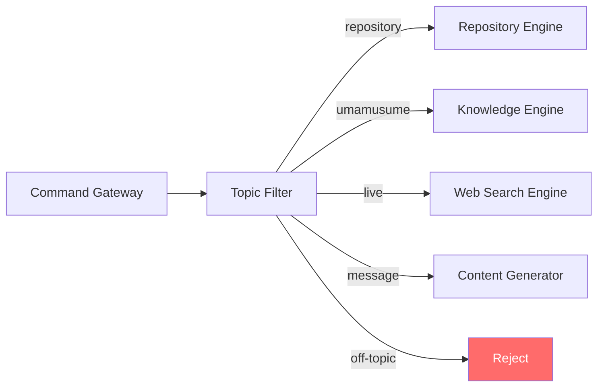

# Topic Filter

**Authority:** `GOVERNANCE/ARCHITECTURE_AUTHORITY.md`
**Registry:** `GOVERNANCE/PIPELINE_REGISTRY.md`
**Department:** Knowledge
**Status:** ACTIVE
**Version:** 1.1.0
**Last Updated:** 2026-07-22

---

## Purpose

The Topic Filter is the scope enforcement gate for the AI Knowledge Service. Every request passes through it before any retrieval or generation occurs. It classifies each request into one of five categories — Repository, Umamusume, Live, Message, or Off-topic — and routes accordingly. Off-topic requests are rejected immediately without any AI provider call.

The Topic Filter is also a security control: it prevents the AI from being used as a general-purpose chatbot.

---

## Scope

| In Scope | Out of Scope |
|---|---|
| Classifying repository questions | Answering the question itself |
| Classifying Umamusume questions | Generating the response |
| Classifying live / current-data questions | Retrieving repository content |
| Classifying message generation requests | Validating response quality |
| Rejecting off-topic requests | |
| Logging all classification decisions | |

---

## Responsibilities

- Receive every incoming request before any other pipeline component
- Classify the request into: `repository`, `umamusume`, `live`, `message`, or `off-topic`
- Route classified requests to the appropriate downstream component
- Reject off-topic requests with a polite, consistent message
- Log every classification decision for audit
- Never allow an off-topic request to reach the API Provider

---

## Architecture



---

## Classification Categories

### Repository

Requests about the Umakraft codebase, architecture, or documentation.

Examples:
- "How does the Vault store data?"
- "What is the Miner responsible for?"
- "Explain the Broadcast pipeline"
- "Show me the fan gain blueprint"
- "What does Article XII of the Architecture Authority say?"

### Umamusume

Requests about Uma Musume: Pretty Derby game mechanics, terminology, or concepts.

Examples:
- "What is MANT?"
- "How is fan gain calculated?"
- "What are the circle rank tiers?"
- "Explain trainer level progression"

### Message

Requests to generate a community message of a specific type.

Examples:
- "/ai message greeting"
- "/ai message milestone trainerName=Akira milestone=500000"
- "/ai message leaderboard"

### Live

Requests about current or external data that cannot be answered from the repository or
the static Umamusume knowledge base. Routes to the Web Search Engine (Tavily).

Examples:
- "What are the top circles on uma.moe right now?"
- "Did the game get a patch this week?"
- "What's the latest MANT threshold change?"
- "Which trainers are trending today?"

### Off-topic

Everything else. Rejected without an AI call.

Examples:
- "Who is the prime minister of Japan?"
- "Write me a Python script"
- "What is the stock price of Nintendo?"
- "Tell me a joke"
- "Who wins in a fight, Goku or Superman?"

---

## Workflow

1. Request arrives from the Command Gateway
2. Topic Filter applies the keyword classifier
3. If keywords are insufficient, a lightweight semantic classifier is used
4. Classification is logged with confidence score
5. If `off-topic`: return rejection message, log, stop
6. If `repository`: forward to Repository Engine
7. If `umamusume`: forward to Knowledge Engine
8. If `live`: forward to Web Search Engine
9. If `message`: forward to Content Generator

---

## Technical Design

### Keyword Classifier

Fast rule-based first pass using keyword lists.

#### Repository Keywords

```text
vault, miner, courier, inspector, refinery, refiner, compiler, depot,
workshop, fabricator, draftsman, blueprint, terminal, broadcast, broker,
archive, announcer, distribution, dispatcher, coordinator, operation,
investigator, manager, governance, architecture, pipeline, stage,
umakraft, uma.moe, task, scheduler, health, cron, fantracking, milestone
```

#### Umamusume Keywords

```text
uma musume, umamusume, pretty derby, mant, fan gain, fan count,
circle rank, trainer level, trainer rank, skill card, race,
fan deficit, projected fans, leaderboard, circle, horse girl
```

#### Message Keywords

```text
generate, message, greeting, announcement, warning, reminder, milestone message,
achievement, leaderboard message, /ai message
```

#### Live Keywords

```text
right now, currently, today, this week, latest, recent, update, patch,
trending, live, current rankings, current top, new event, just announced,
what changed, new season
```

#### Off-topic Indicators

```text
president, prime minister, stock, crypto, sports, movie, music,
recipe, weather, political, medical, legal, relationship, romance,
war, religion, joke, meme, other games (pokémon, fortnite, minecraft, etc.)
```

### Semantic Classifier

Used when keyword matching produces a low-confidence result. A lightweight embedding-based classifier distinguishes between the four categories using pre-built category exemplar vectors.

```text
Confidence threshold: 0.70 — below this, request is treated as off-topic
Override: explicit command type (/ai message, /ai docs, /ai search) always overrides classifier
```

### Override Rules

Some commands bypass the classifier entirely because the intent is explicit:

| Command | Classification |
|---|---|
| `/ai search <query>` | Always `repository` |
| `/ai docs <file>` | Always `repository` |
| `/ai explain <topic>` | `repository` or `umamusume` based on topic |
| `/ai glossary <term>` | Always `umamusume` |
| `/ai live <query>` | Always `live` |
| `/ai message <type>` | Always `message` |

---

## Rejection Response

Off-topic requests receive a consistent, polite rejection:

```text
I'm the Umakraft AI Knowledge Service. I can help with:
• Repository questions — ask about any part of the Umakraft codebase
• Umamusume knowledge — ask about game mechanics, terms, or circle concepts
• Live data — use /ai live to ask about current rankings or recent updates
• Community messages — use /ai message to generate a message

I'm not able to help with general questions outside of these topics.
```

---

## Audit Logging

Every classification is logged:

```js
{
  timestamp: string,
  query: string,
  classification: 'repository' | 'umamusume' | 'live' | 'message' | 'off-topic',
  confidence: number,      // 0.0–1.0
  method: 'keyword' | 'semantic' | 'command-override',
  rejected: boolean
}
```

---

## Best Practices

- Run the keyword classifier first — it is fast and handles the majority of cases
- Only invoke the semantic classifier when keyword confidence is below 0.70
- Log every classification including confidence — this data improves the classifier over time
- Never allow an ambiguous request to reach the API Provider — when in doubt, reject and ask for clarification
- Review off-topic rejection logs weekly to identify patterns that may need classifier updates

---

## Future Expansion

- Active learning — collect labelled examples from rejected requests to retrain the semantic classifier
- Clarification mode — instead of hard rejection, ask the user to clarify ambiguous requests
- Circle leader override — allow privileged users to unlock additional query topics
- Language detection — identify and support non-English requests in scoped languages

---

## Related Documents

- `AI/ARCHITECTURE.md` — full system architecture; Topic Filter position in the pipeline
- `AI/SECURITY.md` — Topic Filter as a security control
- `AI/REPOSITORY_ENGINE.md` — downstream for repository classification
- `AI/KNOWLEDGE_ENGINE.md` — downstream for Umamusume classification
- `AI/CONTENT_GENERATOR.md` — downstream for message classification
- `AI/WEB_SEARCH_ENGINE.md` — downstream for live classification
- `AI/diagrams/AI Pipeline.md` — visual pipeline including Topic Filter

---

## Version History

- `v1.0.0` — Initial Topic Filter specification; four classification categories; keyword classifier; semantic classifier; command override rules; rejection response format; audit logging schema
- `v1.1.0` — Added `live` classification category; Web Search Engine routing; live keyword list; `/ai live` command override; five-category audit log schema
