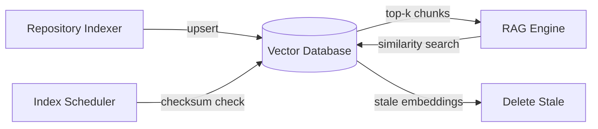

# Vector Database

**Authority:** `GOVERNANCE/ARCHITECTURE_AUTHORITY.md`
**Registry:** `GOVERNANCE/PIPELINE_REGISTRY.md`
**Department:** Knowledge
**Status:** ACTIVE
**Version:** 1.1.0
**Last Updated:** 2026-07-22

---

## Purpose

The Vector Database stores the embedding vectors and metadata for every indexed document chunk in the repository. It is the persistence layer for the RAG Engine's similarity search. At query time it receives a query vector and returns the top-k most similar stored chunks.

**Qdrant** is the selected vector database backend for UmaKraft. It runs as a managed service and is accessed by the Repository Indexer and RAG Engine via the official Qdrant Node.js client (`@qdrant/js-client-rest`). Qdrant provides native HNSW indexing, collection-based namespacing, payload filtering, and a REST API — no custom ANN implementation is required.

---

## Scope

| In Scope | Out of Scope |
|---|---|
| Storing chunk embeddings and metadata | Generating embeddings (API Provider) |
| Cosine similarity search | Document chunking (Repository Indexer) |
| Metadata-filtered search | Prompt assembly |
| Embedding update on re-index | Delivering responses to Discord |
| Deletion of stale embeddings | |
| Backup and restore | |

---

## Responsibilities

- Accept chunk embeddings from the Repository Indexer and store them with metadata
- Perform fast similarity search for the RAG Engine
- Support metadata filtering (department, file type, scope)
- Track indexing timestamps and checksums for incremental update detection
- Delete embeddings for files that have been removed from the repository
- Provide backup and restore for the full embedding store

---

## Architecture



---

## Embedding Schema

Each stored embedding record:

```js
{
  id: string,               // UUID formatted from SHA-256(`${filePath}:${chunkIndex}`):
                            //   take first 32 hex chars, insert dashes as 8-4-4-4-12.
                            //   e.g. "a3f2b1c4-d5e6-f890-abcd-ef1234567890"
                            //   Qdrant requires RFC-4122 UUID strings or uint64 integers.
                            //   This derivation satisfies the UUID format without a uuid package.
  vector: Float32Array,     // embedding vector (e.g. 1536 dimensions for text-embedding-3-small)
  filePath: string,         // e.g. "umamoe/Vault/vault.js"
  chunkIndex: number,       // position of this chunk within the file
  heading: string | null,   // nearest heading above this chunk
  department: string,       // e.g. "Umamoe"
  fileType: string,         // e.g. "JavaScript"
  content: string,          // raw chunk text (stored for citation display)
  tokenCount: number,       // estimated token count of this chunk
  checksum: string,         // SHA-256 of the source file at indexing time
  indexedAt: Date           // when this embedding was created or updated
}
```

---

## Indexing Frequency

| Trigger | Description |
|---|---|
| Startup | Full index run if the vector database is empty |
| Scheduled | Incremental index every 6 hours (configurable via `VDB_INDEX_INTERVAL_HOURS`) |
| Manual | `/ai reindex` command (admin only) |
| Checksum change | Any file whose checksum differs from the stored value is re-indexed automatically |

---

## Similarity Search

### Method

Cosine similarity between the query vector and all stored vectors.

### Performance

Qdrant uses HNSW (Hierarchical Navigable Small World) as its default index. HNSW provides approximate nearest neighbour search with sub-millisecond latency at any scale — no manual configuration is needed. The flat brute-force fallback is available for collections under ~1,000 chunks but is not required in production.

### Search Parameters

```js
{
  queryVector: Float32Array,
  topK: number,           // default 8
  minScore: number,       // default 0.60
  filter: {
    department?: string,
    fileType?: string,
    scope?: string
  }
}
```

---

## Update Policy

| Event | Action |
|---|---|
| New file added | Full index of new file; insert new embeddings |
| File modified | Re-index file; upsert all chunks (delete old, insert new) |
| File deleted | Delete all embeddings for that file path |
| Heading changed within file | Re-index file; update heading metadata for affected chunks |

Upsert is identified by the chunk `id` (SHA-256 of filePath + chunkIndex).

---

## Deletion Policy

Stale embeddings are deleted when:
- The source file no longer exists in the repository
- The source file has been excluded by a new exclusion rule
- A manual `/ai reindex --clean` command is issued (admin only)

Deletion is always logged at `info` level via `core/log.js`.

---

## Cache Integration

The Vector Database integrates with the Cache layer:

- Recently queried vectors are kept in a hot cache for sub-millisecond repeated lookup
- Cache TTL: 10 minutes (configurable via `VDB_QUERY_CACHE_TTL_MS`)
- The cache is keyed by the query vector hash, not the raw query text

---

## Backup and Restore

### Backup

```text
VDB_BACKUP_PATH=/data/vdb_backup
VDB_BACKUP_SCHEDULE=0 2 * * *   (daily at 02:00)
```

Backup format: JSON export of all embedding records (vectors serialised as base64).

### Restore

```bash
# Restore from a backup file
node AI/tools/vdb-restore.js --file /data/vdb_backup/2026-07-22.json
```

Restore replaces the entire vector store and triggers a checksum validation pass.

---

## Qdrant Integration

### Collection Setup

Each UmaKraft department maps to a Qdrant **collection**. The default collection for the full repository index is `umakraft`. Per-department collections can be added later for isolated search.

```js
// Create collection (run once at startup if it does not exist)
await qdrant.createCollection('umakraft', {
  vectors: {
    size:     1536,          // must match AI_EMBEDDING_MODEL dimension
    distance: 'Cosine'
  }
});
```

### Upsert

```js
await qdrant.upsert('umakraft', {
  wait: true,
  points: [{
    id:      chunkId,        // SHA-256 of (filePath + chunkIndex), truncated to UUID format
    vector:  embeddingVector,
    payload: {
      filePath, chunkIndex, heading, department, fileType, content, tokenCount, checksum, indexedAt
    }
  }]
});
```

### Similarity Search

```js
const results = await qdrant.search('umakraft', {
  vector: queryVector,
  limit:  topK,              // default 8
  score_threshold: minScore, // default 0.60
  filter: {
    must: [
      { key: 'department', match: { value: department } }  // optional metadata filter
    ]
  },
  with_payload: true
});
```

### Client Configuration

```text
QDRANT_URL=https://<your-cluster>.cloud.qdrant.io
QDRANT_API_KEY=<secret>
QDRANT_COLLECTION=umakraft
```

The Qdrant client is initialised once at startup and shared across all components that need vector access. API keys are loaded from environment variables and never logged or exposed.

---

## Configuration

```text
QDRANT_URL=https://<your-cluster>.cloud.qdrant.io   # Qdrant managed service URL
QDRANT_API_KEY=<secret>                              # Qdrant API key
QDRANT_COLLECTION=umakraft                           # default collection name
VDB_EMBEDDING_DIM=1536          # must match the embedding model dimension
VDB_TOP_K=8
VDB_MIN_SCORE=0.60
VDB_INDEX_INTERVAL_HOURS=6
VDB_QUERY_CACHE_TTL_MS=600000
VDB_BACKUP_PATH=/data/vdb_backup
```

---

## Best Practices

- Always verify that the embedding dimension in the database matches the currently configured embedding model before querying
- Log every upsert and delete event for audit trails
- Never expose raw embedding vectors in API responses or logs
- Run a checksum validation pass after every restore
- Prefer `upsert` over `delete + insert` to avoid search gaps during re-indexing

---

## Future Expansion

- Multi-modal embeddings for code and documentation in separate vector spaces
- Per-department Qdrant collections for isolated search namespaces
- Cross-repository search (future multi-repo support)
- Embedding drift detection — re-index when the embedding model is upgraded
- Qdrant snapshot-based backup (replaces JSON export)

---

## Related Documents

- `AI/REPOSITORY_INDEXER.md` — produces the chunks stored here
- `AI/RAG_ENGINE.md` — queries this database for retrieval
- `AI/CACHE.md` — query result caching layer
- `AI/CONFIGURATION.md` — VDB environment variables
- `AI/diagrams/Repository Flow.md` — visual indexing and retrieval flow

---

## Version History

- `v1.0.0` — Initial Vector Database specification; embedding schema; similarity search; update and deletion policy; backup and restore; cache integration; configuration variables
- `v1.1.0` — Qdrant selected as the vector database backend; Qdrant Integration section added (collection setup, upsert, similarity search, client config); HNSW noted as native (no custom ANN needed); configuration variables updated to Qdrant env vars
- `v1.2.0` — Point `id` derivation made explicit: UUID formatted from first 32 hex chars of SHA-256(`${filePath}:${chunkIndex}`) in 8-4-4-4-12 grouping; no uuid package required
