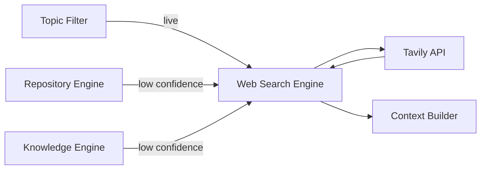

# Web Search Engine

**Authority:** `GOVERNANCE/ARCHITECTURE_AUTHORITY.md`
**Registry:** `GOVERNANCE/PIPELINE_REGISTRY.md`
**Department:** Knowledge
**Status:** ACTIVE
**Version:** 1.0.0
**Last Updated:** 2026-07-22

---

## Purpose

The Web Search Engine is the live data retrieval component of the AI Knowledge Service.
It answers questions that the Repository Engine and Knowledge Engine cannot — anything
requiring current or external information: recent uma.moe events, live rankings, patch
notes, community news, or anything not yet absorbed into the repository or the static
knowledge base.

It uses the **Tavily Search API**, which returns pre-extracted, LLM-ready content chunks
rather than raw URLs. This means its output plugs directly into the Context Builder
alongside RAG chunks and Knowledge Engine entries — no scraping layer required.

---

## Scope

| In Scope | Out of Scope |
|---|---|
| Live uma.moe data not yet in Refinery/Depot | General web browsing |
| Recent Umamusume patch notes and updates | Searching social media |
| Current circle rankings from external sources | Replacing the Repository Engine for repo questions |
| Community news and announcements | Caching search results long-term (handled by Cache layer) |
| Fallback when RAG confidence is below threshold | Answering off-topic questions |

---

## Responsibilities

- Receive a classified `live` query from the Topic Filter, or a low-confidence fallback
  signal from the Repository Engine or Knowledge Engine
- Build a scoped Tavily search query from the user question (injecting uma.moe domain
  context where relevant)
- Call the Tavily Search API and collect the top-k result chunks
- Return structured result chunks to the Context Builder in the same format as RAG chunks
- Never route general off-topic queries through Tavily — Topic Filter enforces scope
  before Web Search Engine is called

---

## Architecture



---

## When Web Search Engine Is Called

### Primary path — Topic Filter routes `live`

The Topic Filter classifies the request as `live` when the question is explicitly about
current or real-world data that cannot come from the repository or the static knowledge
base.

Examples:
- "What are the current top circles on uma.moe?"
- "Did the game get an update this week?"
- "What's the latest MANT threshold change?"

### Fallback path — low RAG or Knowledge Engine confidence

The Repository Engine or Knowledge Engine returns a confidence score with every answer.
When the score falls below the fallback threshold (default `0.65`), the Web Search Engine
is called as a supplement — its results are merged into the context window alongside the
low-confidence local chunks.

```text
RAG confidence < 0.65
    → Web Search Engine called with original query
    → Tavily results merged into Context Builder alongside RAG chunks
    → Prompt System receives combined context
```

---

## Tavily Integration

### API Call

```javascript
// Single search call
const response = await tavily.search({
  query:          scopedQuery,        // user question + uma.moe context injection
  search_depth:   'advanced',         // returns full content, not just snippets
  max_results:    5,                  // top-5 results per call
  include_domains: ['uma.moe'],       // prefer uma.moe results; not exclusive
  include_answer:  false,             // raw chunks only — Context Builder assembles
});
```

### Query Scoping

The user question is augmented with domain context before being sent to Tavily:

```text
User: "What are the top circles right now?"
Scoped: "uma.moe top circles current rankings Umamusume Pretty Derby"
```

Scoping prevents Tavily from returning irrelevant results for ambiguous terms like
"circle" or "ranking".

### Output Format

Tavily returns a list of result objects. Each is normalised into the same chunk schema
used by the RAG Engine:

```json
{
  "content":   "Extracted page content from Tavily...",
  "filePath":  "https://uma.moe/circles/rankings",
  "heading":   "Circle Rankings — July 2026",
  "relevance": 0.87,
  "source":    "web"
}
```

The `source: "web"` flag lets the Context Builder and Response Validator distinguish
web-sourced chunks from repository-sourced chunks, which is important for citation
formatting and hallucination checking.

---

## Context Builder Integration

Web search chunks are passed to the Context Builder alongside RAG chunks and Knowledge
Engine entries. The Context Builder applies the same deduplication, ranking, and token
budget rules to all chunk sources.

Web chunks are formatted with a `[WEB]` source tag in the citation header:

```text
---
Source: [WEB] https://uma.moe/circles/rankings
Section: Circle Rankings — July 2026
Relevance: 0.87
---
Top-ranked circle this week: Bloom, with 4.2M fan gain...
---
```

---

## Rate Limiting and Cost Control

| Control | Value |
|---------|-------|
| Max Tavily calls per user per minute | 3 |
| Max Tavily calls per bot per minute | 20 |
| Max results per call | 5 |
| Cache TTL for identical queries | 10 minutes |
| Fallback threshold (RAG confidence) | 0.65 |

Caching is handled by the Cache layer. Identical queries within the TTL window return
the cached Tavily result set without a new API call.

---

## Error Handling

| Condition | Behaviour |
|-----------|-----------|
| Tavily API unavailable | Log error, continue with local context only (RAG + Knowledge Engine); do not surface the error to the user unless local context is also empty |
| Tavily returns 0 results | Log, continue with local context |
| Rate limit hit | Return cached result if available; otherwise continue with local context |
| Query scoping produces empty string | Use original user question verbatim |

The Web Search Engine never fails the entire request. It degrades gracefully — if Tavily
cannot be reached, the response is generated from local context alone.

---

## Security

- The Tavily API key is loaded from environment (`TAVILY_API_KEY`) and never appears in
  any prompt, log, or response
- Only scoped, on-topic queries are sent to Tavily — the Topic Filter enforces this
  before the Web Search Engine is ever called
- Raw Tavily content is passed through the Response Validator before delivery; no
  unvalidated web content is returned to Discord users

---

## Environment Variables

| Variable | Required | Description |
|----------|----------|-------------|
| `TAVILY_API_KEY` | Yes | Tavily Search API key |
| `TAVILY_MAX_RESULTS` | No | Max results per call (default: `5`) |
| `TAVILY_CACHE_TTL_MS` | No | Cache duration in ms (default: `600000` — 10 min) |
| `TAVILY_CONFIDENCE_FALLBACK` | No | RAG confidence threshold that triggers fallback (default: `0.65`) |

---

## Interface

```javascript
// Primary call — from Topic Filter (live classification)
const chunks = await webSearchEngine.search(query, options)

// Fallback call — from Repository Engine or Knowledge Engine
const chunks = await webSearchEngine.searchFallback(query, localConfidence)

// Returns: Array of chunk objects compatible with Context Builder
// [{ content, filePath, heading, relevance, source: 'web' }]
```

---

## Related Documents

- `AI/ARCHITECTURE.md` — Web Search Engine position in the full system
- `AI/TOPIC_FILTER.md` — live classification category and routing
- `AI/CONTEXT_BUILDER.md` — how web chunks are merged with RAG and Knowledge Engine chunks
- `AI/CACHE.md` — query result caching
- `AI/RESPONSE_VALIDATOR.md` — validation of web-sourced content before delivery
- `AI/SECURITY.md` — API key handling and scope enforcement
- `AI/CONFIGURATION.md` — environment variable reference

---

## Version History

- `v1.0.0` — Initial Web Search Engine specification; Tavily integration; primary and
  fallback call paths; chunk normalisation schema; rate limiting and cost controls;
  graceful degradation on API failure
