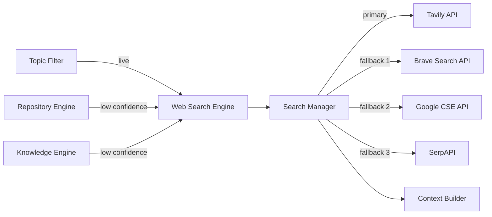

# Web Search Engine

**Authority:** `GOVERNANCE/ARCHITECTURE_AUTHORITY.md`
**Registry:** `GOVERNANCE/PIPELINE_REGISTRY.md`
**Department:** Knowledge
**Status:** ACTIVE
**Version:** 1.1.0
**Last Updated:** 2026-07-22

---

## Purpose

The Web Search Engine is the live data retrieval component of the AI Knowledge Service.
It answers questions that the Repository Engine and Knowledge Engine cannot — anything
requiring current or external information: recent uma.moe events, live rankings, patch
notes, community news, or anything not yet absorbed into the repository or the static
knowledge base.

All provider calls are managed by an internal **Search Manager** layer. The Search
Manager selects the active provider, handles failover between providers, and normalises
every response into a single chunk schema before passing results to the Context Builder.

The primary provider is **Tavily**, which returns pre-extracted, LLM-ready content
chunks — no scraping layer required. Three backup providers fire in order if Tavily
is unavailable: **Brave Search API → Google Custom Search JSON API → SerpAPI**.

---

## Scope

| In Scope | Out of Scope |
|---|---|
| Live uma.moe data not yet in Refinery/Depot | General web browsing |
| Recent Umamusume patch notes and updates | Searching social media |
| Current circle rankings from external sources | Replacing the Repository Engine for repo questions |
| Community news and announcements | Caching search results long-term (handled by Cache layer) |
| Fallback when RAG confidence is below threshold | Answering off-topic questions |

---

## Responsibilities

- Receive a classified `live` query from the Topic Filter, or a low-confidence fallback
  signal from the Repository Engine or Knowledge Engine
- Build a scoped search query from the user question (injecting uma.moe domain context
  where relevant)
- Delegate the call to the Search Manager, which selects the active provider and handles
  failover automatically
- Receive normalised chunk objects from the Search Manager
- Return structured result chunks to the Context Builder in the same format as RAG chunks
- Never route general off-topic queries to search — the Topic Filter enforces scope
  before the Web Search Engine is ever called

---

## Architecture



---

## Search Manager

The Search Manager is the internal component that owns all provider interaction. The
Web Search Engine calls it with a scoped query and receives a normalised chunk array
back. The rest of the system never talks to individual providers directly.

### Provider Chain

| Priority | Provider | Notes |
|----------|----------|-------|
| 1 | Tavily | Pre-extracted, LLM-ready chunks; no scraping needed |
| 2 | Brave Search API | Independent index; fast; good coverage for niche topics |
| 3 | Google Custom Search JSON API | Broadest index; reliable fallback |
| 4 | SerpAPI | True last resort; most expensive; use only if 1–3 all fail |

### Failover Rules

A backup provider fires **only** when the active provider:

- Returns an HTTP error (4xx / 5xx)
- Times out (configurable per provider; default `5000 ms`)
- Hits a rate limit (429 response)

A backup does **not** fire on an empty result set — zero results from Tavily is a valid
answer (the Context Builder will fall back to local context alone).

Each provider is tried once in order. If all four fail, the Web Search Engine returns an
empty array and logs a `SEARCH_ALL_PROVIDERS_FAILED` event. The request continues with
local context only.

### Per-Provider Normaliser

Every provider returns a different response schema. The Search Manager contains a
normaliser for each provider that maps its output into the shared chunk object before
anything downstream sees it:

```javascript
// Shared chunk schema — identical to RAG Engine chunk output
{
  content:   String,   // extracted text content
  filePath:  String,   // source URL
  heading:   String,   // page title or section heading
  relevance: Number,   // 0.0 – 1.0; provider score mapped to this range
  source:    'web'     // always 'web' for Search Manager output
}
```

Provider-specific mappings:

| Field | Tavily | Brave | Google CSE | SerpAPI |
|-------|--------|-------|------------|---------|
| `content` | `result.content` | `result.description` | `item.snippet` | `result.snippet` |
| `filePath` | `result.url` | `result.url` | `item.link` | `result.link` |
| `heading` | `result.title` | `result.title` | `item.title` | `result.title` |
| `relevance` | `result.score` | mapped from rank position | mapped from rank position | mapped from rank position |

Brave, Google CSE, and SerpAPI do not return a semantic relevance score — relevance is
approximated from rank position using a linear decay (`1.0` for rank 1, decreasing by
`0.05` per position).

---

## When Web Search Engine Is Called

### Primary path — Topic Filter routes `live`

The Topic Filter classifies the request as `live` when the question is explicitly about
current or real-world data that cannot come from the repository or the static knowledge
base.

Examples:
- "What are the current top circles on uma.moe?"
- "Did the game get an update this week?"
- "What's the latest MANT threshold change?"

### Fallback path — low RAG or Knowledge Engine confidence

The Repository Engine or Knowledge Engine returns a confidence score with every answer.
When the score falls below the fallback threshold (default `0.65`), the Web Search Engine
is called as a supplement — its results are merged into the context window alongside the
low-confidence local chunks.

```text
RAG confidence < 0.65
    → Web Search Engine called with original query
    → Tavily results merged into Context Builder alongside RAG chunks
    → Prompt System receives combined context
```

---

## Tavily Integration

### API Call

```javascript
// Single search call
const response = await tavily.search({
  query:          scopedQuery,        // user question + uma.moe context injection
  search_depth:   'advanced',         // returns full content, not just snippets
  max_results:    5,                  // top-5 results per call
  include_domains: ['uma.moe'],       // prefer uma.moe results; not exclusive
  include_answer:  false,             // raw chunks only — Context Builder assembles
});
```

### Query Scoping

The user question is augmented with domain context before being sent to Tavily:

```text
User: "What are the top circles right now?"
Scoped: "uma.moe top circles current rankings Umamusume Pretty Derby"
```

Scoping prevents Tavily from returning irrelevant results for ambiguous terms like
"circle" or "ranking".

### Output Format

Tavily returns a list of result objects. Each is normalised into the same chunk schema
used by the RAG Engine:

```json
{
  "content":   "Extracted page content from Tavily...",
  "filePath":  "https://uma.moe/circles/rankings",
  "heading":   "Circle Rankings — July 2026",
  "relevance": 0.87,
  "source":    "web"
}
```

The `source: "web"` flag lets the Context Builder and Response Validator distinguish
web-sourced chunks from repository-sourced chunks, which is important for citation
formatting and hallucination checking.

---

## Context Builder Integration

Web search chunks are passed to the Context Builder alongside RAG chunks and Knowledge
Engine entries. The Context Builder applies the same deduplication, ranking, and token
budget rules to all chunk sources.

Web chunks are formatted with a `[WEB]` source tag in the citation header:

```text
---
Source: [WEB] https://uma.moe/circles/rankings
Section: Circle Rankings — July 2026
Relevance: 0.87
---
Top-ranked circle this week: Bloom, with 4.2M fan gain...
---
```

---

## Rate Limiting and Cost Control

### Per-User and Per-Bot Limits

| Control | Value |
|---------|-------|
| Max Search Manager calls per user per minute | 3 |
| Max Search Manager calls per bot per minute | 20 |
| Max results per call (all providers) | 5 |
| Cache TTL for identical queries | 10 minutes |
| Fallback threshold (RAG confidence) | 0.65 |

Caching is handled by the Cache layer. An identical query within the TTL window returns
the cached result set without any provider call — regardless of which provider originally
answered it.

### Provider Timeout Budget

| Provider | Timeout |
|----------|---------|
| Tavily | 5 000 ms |
| Brave | 5 000 ms |
| Google CSE | 5 000 ms |
| SerpAPI | 5 000 ms |

### Cost Tier (relative, ascending)

Tavily < Brave < Google CSE < SerpAPI

SerpAPI is materially more expensive than the others. It fires only when all three
preceding providers have failed — which for a 30-user bot should be a rare event.

---

## Error Handling

### Provider-Level Failover

| Condition | Behaviour |
|-----------|-----------|
| Tavily error / timeout / rate-limit | Search Manager moves to Brave; logs `TAVILY_FAILOVER` |
| Brave error / timeout / rate-limit | Search Manager moves to Google CSE; logs `BRAVE_FAILOVER` |
| Google CSE error / timeout / rate-limit | Search Manager moves to SerpAPI; logs `GCSE_FAILOVER` |
| SerpAPI error / timeout / rate-limit | All providers exhausted; logs `SEARCH_ALL_PROVIDERS_FAILED`; returns empty array |
| Any provider returns 0 results | Not a failover trigger; returns empty array for that call |
| Rate limit hit with cached result available | Return cached result; no failover needed |
| Query scoping produces empty string | Use original user question verbatim |

### Degradation on Empty Array

When the Search Manager returns an empty array (all providers failed or all returned
zero results), the Context Builder receives only local context (RAG + Knowledge Engine
chunks). The request continues normally. The error is not surfaced to the Discord user
unless local context is also empty, in which case the Response Validator triggers a
polite "I don't have enough information" reply.

---

## Security

- All API keys are loaded from environment variables and never appear in any prompt,
  log, or Discord response
- Only scoped, on-topic queries are sent to any provider — the Topic Filter enforces
  this before the Web Search Engine is ever called
- Raw provider content is passed through the Response Validator before delivery; no
  unvalidated web content is returned to Discord users

---

## Environment Variables

| Variable | Required | Description |
|----------|----------|-------------|
| `TAVILY_API_KEY` | Yes | Tavily Search API key (primary provider) |
| `BRAVE_SEARCH_API_KEY` | Yes | Brave Search API key (fallback 1) |
| `GOOGLE_CSE_API_KEY` | Yes | Google Custom Search JSON API key (fallback 2) |
| `GOOGLE_CSE_CX` | Yes | Google Custom Search Engine ID (fallback 2) |
| `SERPAPI_API_KEY` | Yes | SerpAPI key (fallback 3 — last resort) |
| `SEARCH_MAX_RESULTS` | No | Max results per call, all providers (default: `5`) |
| `SEARCH_PROVIDER_TIMEOUT_MS` | No | Per-provider timeout in ms (default: `5000`) |
| `SEARCH_CACHE_TTL_MS` | No | Cache duration in ms (default: `600000` — 10 min) |
| `SEARCH_CONFIDENCE_FALLBACK` | No | RAG confidence threshold that triggers web fallback (default: `0.65`) |

---

## Interface

```javascript
// Primary call — from Topic Filter (live classification)
const chunks = await webSearchEngine.search(query, options)

// Fallback call — from Repository Engine or Knowledge Engine
const chunks = await webSearchEngine.searchFallback(query, localConfidence)

// Both methods delegate to the Search Manager internally.
// Returns: Array of normalised chunk objects compatible with Context Builder.
// [{ content, filePath, heading, relevance, source: 'web' }]
// Returns [] if all providers fail or return zero results.
```

### Search Manager Interface (internal)

```javascript
// Called by Web Search Engine only — not exposed to the rest of the system
const chunks = await searchManager.query(scopedQuery, maxResults)

// searchManager.query() tries providers in order:
//   Tavily → Brave → Google CSE → SerpAPI
// Advances to the next provider on error / timeout / rate-limit.
// Returns normalised chunks from whichever provider answered first.
// Returns [] if all four fail.
```

---

## Related Documents

- `AI/ARCHITECTURE.md` — Web Search Engine position in the full system
- `AI/TOPIC_FILTER.md` — live classification category and routing
- `AI/CONTEXT_BUILDER.md` — how web chunks are merged with RAG and Knowledge Engine chunks
- `AI/CACHE.md` — query result caching
- `AI/RESPONSE_VALIDATOR.md` — validation of web-sourced content before delivery
- `AI/SECURITY.md` — API key handling and scope enforcement
- `AI/CONFIGURATION.md` — environment variable reference

---

## Version History

- `v1.0.0` — Initial Web Search Engine specification; Tavily integration; primary and
  fallback call paths; chunk normalisation schema; rate limiting and cost controls;
  graceful degradation on API failure
- `v1.1.0` — Added Search Manager layer with four-provider chain (Tavily → Brave →
  Google CSE → SerpAPI); per-provider normaliser schema; failover rules (error/timeout/
  rate-limit only, not on empty results); per-provider timeout budget; cost tier table;
  expanded environment variables; updated interface docs
