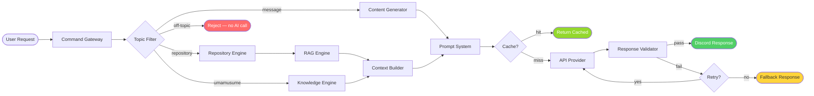

# AI Pipeline Diagram

**Department:** Knowledge — AI
**Version:** 1.0.0
**Last Updated:** 2026-07-22

---

## Request-to-Response Pipeline



---

## Pipeline Stages

| Stage | Component | Input | Output |
|---|---|---|---|
| 1 | Command Gateway | Discord interaction | Parsed command + query |
| 2 | Topic Filter | Query text | Classification + routed request |
| 3 | Repository Engine / Knowledge Engine / Content Generator | Routed request | Retrieved context or message intent |
| 4 | RAG Engine | User query | Ranked document chunks |
| 5 | Context Builder | Ranked chunks + knowledge | Assembled context block |
| 6 | Prompt System | Context + template + variables | Full assembled prompt |
| 7 | Cache | Prompt hash | Cache hit or miss |
| 8 | API Provider | Assembled prompt | Raw AI response |
| 9 | Response Validator | Raw response | Validated response or retry trigger |
| 10 | Discord Response | Validated response | Message sent to Discord channel |

---

## Fast Path (Cache Hit)

```text
User → Gateway → Topic Filter → Cache HIT → Discord (no AI call)
```

Average latency on cache hit: **< 50ms**

## Slow Path (Cache Miss)

```text
User → Gateway → Topic Filter → Retrieval → Prompt Assembly → AI Provider → Validation → Discord
```

Average latency on cache miss: **800ms – 3000ms** depending on provider and context size.

---

## Related Documents

- `AI/ARCHITECTURE.md` — full architecture prose
- `AI/diagrams/Architecture.md` — component layout diagram
- `AI/diagrams/Sequence.md` — full sequence including all actors
- `AI/CACHE.md` — cache layer detail
