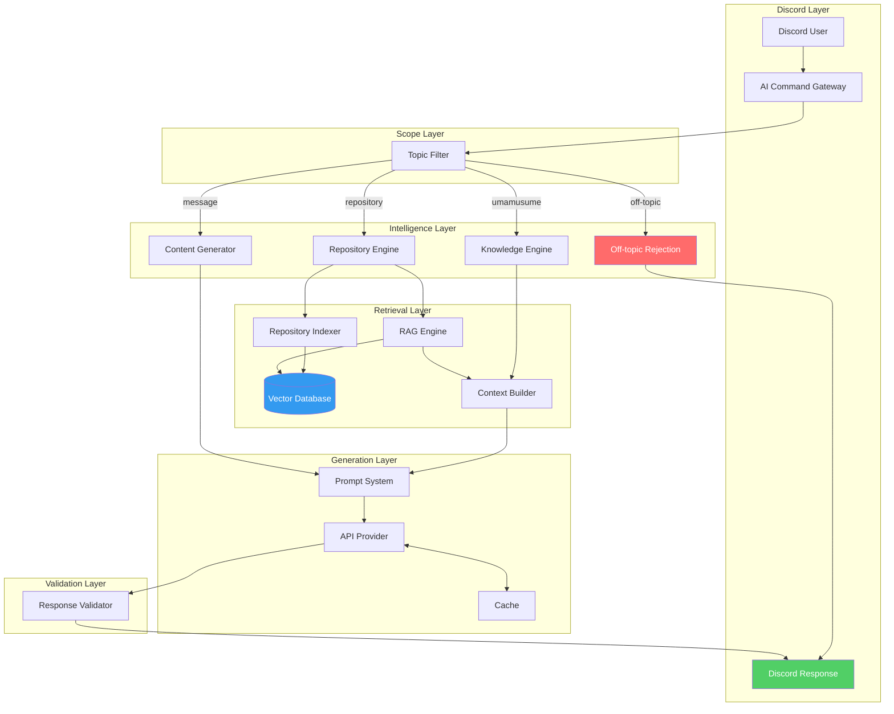

# Architecture Diagram

**Department:** Knowledge — AI
**Version:** 1.0.0
**Last Updated:** 2026-07-22

---

## Full System Architecture

---

## Layer Descriptions

| Layer | Components | Purpose |
|---|---|---|
| Discord Layer | Command Gateway, Discord Response | User-facing input/output |
| Scope Layer | Topic Filter | Request classification and routing |
| Intelligence Layer | Repository Engine, Knowledge Engine, Content Generator | Domain-specific request handling |
| Retrieval Layer | Indexer, Vector DB, RAG Engine, Context Builder | Repository content retrieval |
| Generation Layer | Prompt System, API Provider, Cache | AI text generation |
| Validation Layer | Response Validator | Quality and safety enforcement |

---

## Component Count

| Layer | Count |
|---|---|
| Discord Layer | 2 |
| Scope Layer | 1 |
| Intelligence Layer | 4 (including rejection) |
| Retrieval Layer | 4 |
| Generation Layer | 3 |
| Validation Layer | 1 |
| **Total** | **15** |

---

## Related Documents

- `AI/ARCHITECTURE.md` — full architecture prose
- `AI/diagrams/AI Pipeline.md` — request-to-response pipeline
- `AI/diagrams/Repository Flow.md` — repository indexing flow
- `AI/diagrams/Sequence.md` — full sequence diagram
- `AI/diagrams/Message Flow.md` — message generation flow
