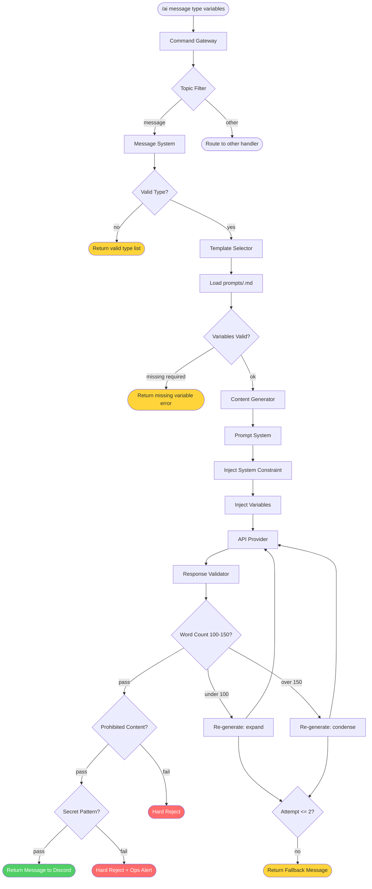
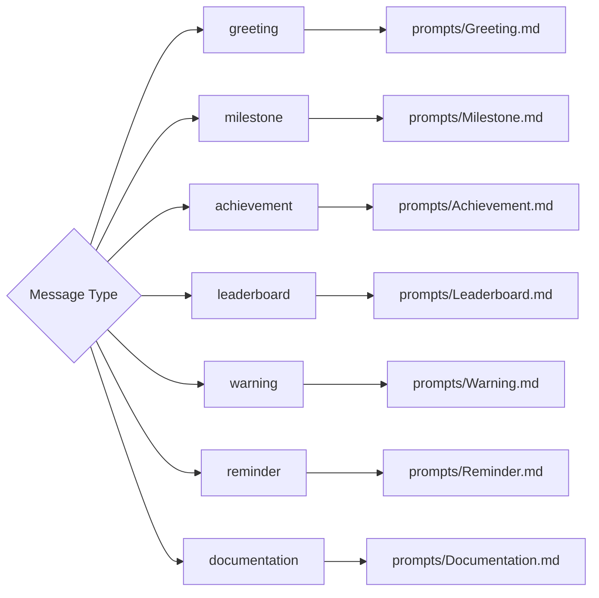

# Message Flow Diagram

**Department:** Knowledge — AI
**Version:** 1.0.0
**Last Updated:** 2026-07-22

---

## Community Message Generation Flow

---

## Message Type Decision Tree

---

## Re-generation Logic

| Attempt | Word Count | Action |
|---|---|---|
| 1 | < 100 | Re-generate with expand instruction |
| 1 | > 150 | Re-generate with condense instruction |
| 2 | < 100 or > 150 | Re-generate one final time |
| 3+ | Any | Return fallback message for the type |

---

## Validation Checks Applied to Messages

| Check | Applied | Notes |
|---|---|---|
| Word count (100–150) | ✅ | Primary enforcement for message type |
| Prohibited content | ✅ | Hard reject |
| Secret pattern | ✅ | Hard reject + ops alert |
| Scope check | ✅ | Message must not contain system-internal content |
| Citation check | ❌ | Not required for messages |
| Hallucination check | ❌ | Not applicable to generated messages |

---

## Related Documents

- `AI/MESSAGE_SYSTEM.md` — message type registry
- `AI/CONTENT_GENERATOR.md` — generation pipeline detail
- `AI/RESPONSE_VALIDATOR.md` — validation checks
- `AI/prompts/` — all seven template files
- `AI/diagrams/Sequence.md` — full sequence including re-generation
