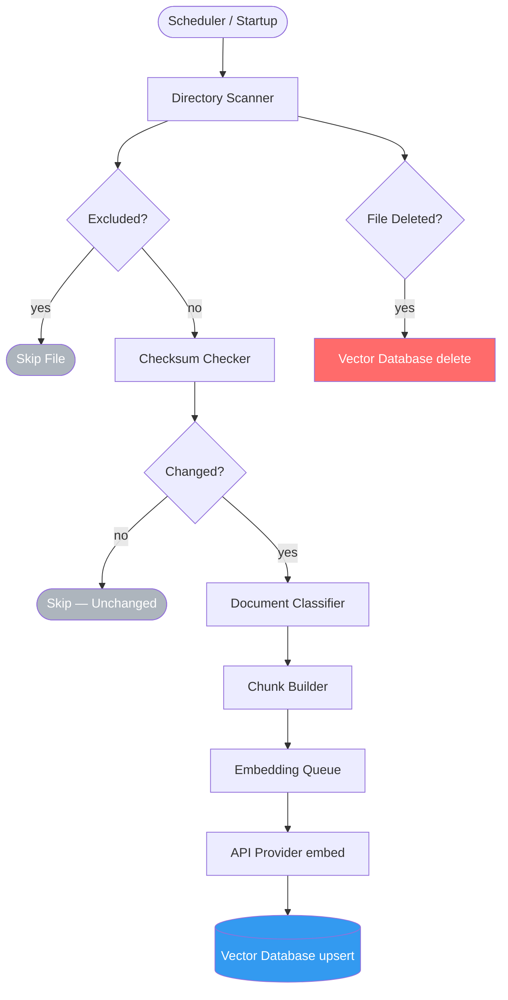

# Repository Flow Diagram

**Department:** Knowledge — AI
**Version:** 1.0.0
**Last Updated:** 2026-07-22

---

## Repository Indexing Flow



---

## Repository Query Flow


---

## Indexing Schedule

| Trigger | Type | Description |
|---|---|---|
| Startup (empty VDB) | Full | Index all non-excluded files |
| Startup (VDB populated) | Incremental | Re-index only changed files |
| Every 6 hours | Incremental | Checksum diff scan |
| `/ai reindex` (admin) | Full | Force complete re-index |
| `/ai reindex --clean` (admin) | Clean + Full | Delete all, then full re-index |

---

## Chunk Boundaries

```text
Priority 1: ## or ### heading boundaries (Markdown)
Priority 2: Function/class boundary (JavaScript)
Priority 3: Paragraph boundary (blank line)
Priority 4: Sentence boundary (period + space)
Fallback:   Hard cut at 1200 characters
```

---

## Related Documents

- `AI/REPOSITORY_ENGINE.md` — orchestrates this flow
- `AI/REPOSITORY_INDEXER.md` — indexing pipeline detail
- `AI/RAG_ENGINE.md` — query retrieval pipeline
- `AI/VECTOR_DATABASE.md` — storage layer
