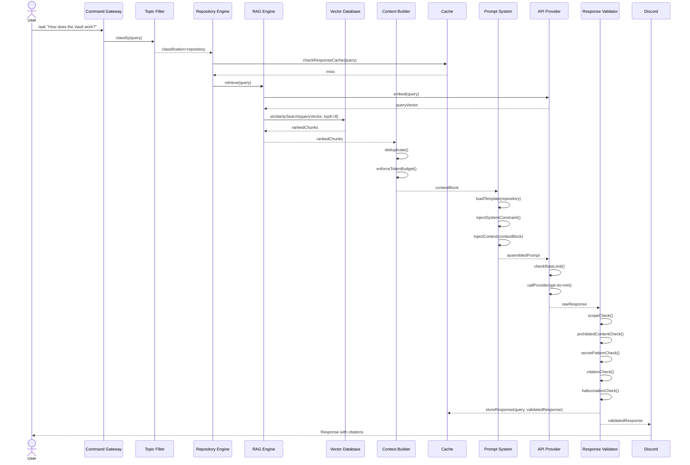
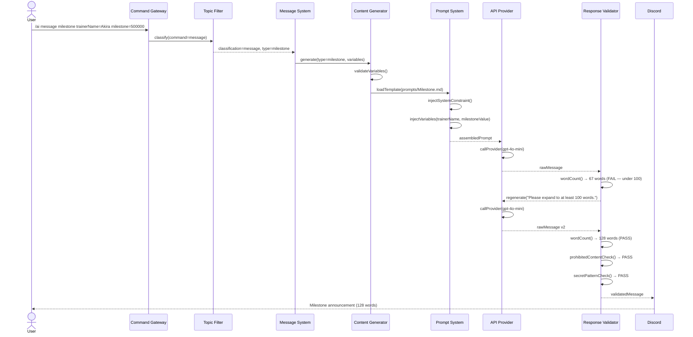
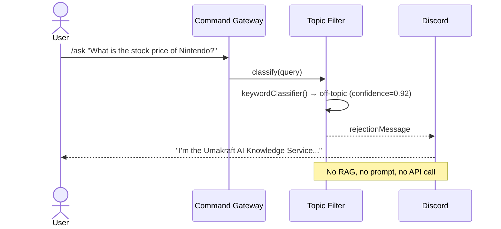

# Sequence Diagram

**Department:** Knowledge — AI
**Version:** 1.0.0
**Last Updated:** 2026-07-22

---

## Full Request Sequence — Repository Question

---

## Full Request Sequence — Message Generation

---

## Off-Topic Sequence (No AI Call)

---

## Related Documents

- `AI/ARCHITECTURE.md` — component descriptions
- `AI/diagrams/AI Pipeline.md` — simplified pipeline view
- `AI/diagrams/Message Flow.md` — message generation flow
- `AI/TOPIC_FILTER.md` — classification logic
- `AI/RESPONSE_VALIDATOR.md` — validation checks
